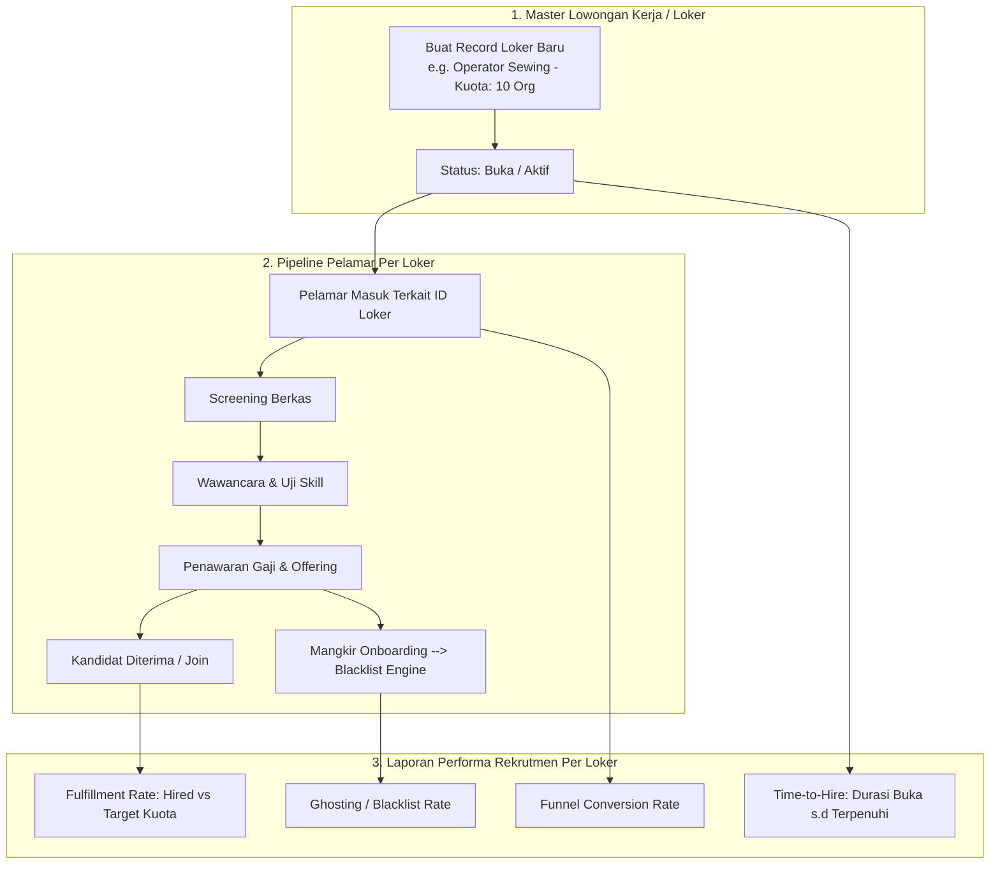
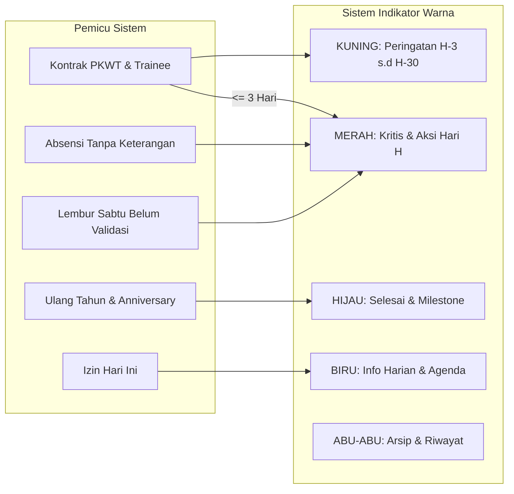

# Rencana Pengembangan Sistem HRIS / HCM (Human Capital Management) NISGroup

Dokumen ini merupakan perencanaan teknis dan operasional komprehensif implementasi modul **HRIS / HCM** pada platform NISReport. Dokumen ini dirancang secara detail berdasarkan analisis data faktual pada: `Blueprint Website HCM NIS.xlsx`.

---

## 1. Visi Arsitektur & Prinsip Tata Kelola

Sistem HCM NISGroup adalah sistem tata kelola sumber daya manusia dari hulu ke hilir (*hire-to-retire*) untuk industri manufaktur garmen dan operasional kantor pusat. Sistem ini mencakup 4 tipe tenaga kerja: **Managerial**, **Kontrak (PKWT)**, **Borongan (Produksi/Jahit/Potong)**, dan **Peserta Magang (SMK)** di bawah naungan entitas legal NISGroup (**CV Bawang Merah** dan **CV Bawang Putih**).

### A. Prinsip Double Sign-Off Governance
Semua transaksi keuangan kepegawaian (Lembur Mingguan & Uang Makan Bulanan) menganut prinsip pemisahan tugas (*Segregation of Duties*):
```
[Operasional / Lapangan] ──> Jam Lembur / Kehadiran Riil
                                      ↓
[HCM Admin / Gatekeeper Data] ─> Audit Absensi & Jam Riil ──> [Tombol: "Approve & Sign HCM"]
                                                                      ↓ (Status: APPROVED_BY_HCM)
                                                              [Data Terkunci untuk HCM]
                                                                      ↓
[Finance / Gatekeeper Dana]  ──> Audit Nominal Kas/Bank  ──> [Tombol: "Sign & Paid"]
                                                                      ↓ (Status: PAID_COMPLETED)
                                                              [Kunci Permanen / Read-Only]
```
### B. Integrasi Menu Sidebar "HCM Group" (Struktur Navigasi Sistem)
Sistem HCM diintegrasikan ke dalam navigasi utama sistem (`SidebarContent.jsx`) sebagai kelompok menu tersendiri (**"HCM / Kepegawaian"**) yang sejajar dengan modul Operasional dan Keuangan yang sudah ada:

```
[ SIDEBAR NISREPORT ]
├── Utama (Dashboard)
├── Administrasi (Brand, Target, User, Role)
├── Master Data (Produk, Pelanggan, Kategori)
├── Produksi (Order, Kanban, Tracking)
├── Keuangan (Arus Kas, Tagihan, Piutang)
│
└── 👥 HCM / KEPEGAWAIAN (Section Baru)
    ├── 📊 Dashboard HCM            (route: 'hcm.dashboard')
    ├── 👨‍💼 Master Karyawan & Magang (route: 'hcm.employees.index')
    ├── ⏱️ Presensi & Lembur        (route: 'hcm.attendance.index')
    │   ├── Matrix Editor Absensi Harian (Bulk Logger)
    │   └── Lembur Mingguan & Payout
    ├── 🍽️ Uang Makan Bulanan       (route: 'hcm.meal-allowance.index')
    ├── 🎯 Loker & Rekrutmen         (route: 'hcm.recruitment.index')
    │   ├── Master Lowongan Kerja (Loker)
    │   ├── Pipeline Pelamar & Blacklist
    │   └── Laporan Performa Rekrutmen
    ├── 📁 Dokumen & Persuratan     (route: 'hcm.documents.index')
    │   ├── Dokumen Internal (RAB & Realisasi)
    │   ├── Korespondensi Eksternal (BPJS/Disnaker)
    │   └── Buku Agenda Penomoran Surat
    └── 📅 Kalender & Event Sosial  (route: 'hcm.calendar.index')
```

### C. Sinkronisasi RBAC & Sistem Notifikasi Existing

1. **Integrasi Spatie Laravel Permission**:
   Menyambung langsung dengan arsitektur role dan permission yang telah berjalan pada model `User`:
   - **Role Baru**:
     - `hcm_manager`: Akses penuh ke seluruh modul HCM, berwenang melakukan approval cuti/izin, penetapan loker, dan menandatangani `[Approve & Sign HCM]` untuk lembur & uang makan.
     - `hcm_staff`: Input absensi harian (bulk matrix), rekam pelamar, input lembur, input dokumen internal & agenda event.
     - `finance_payroll`: Mengakses antrean verifikasi lembur & uang makan pasca disahkan HCM, berwenang mengeksekusi `[Sign & Paid]`.
     - `production_lead`: Memantau absensi regu produksinya dan mengajukan lembur regu.
   - **Daftar Izin Granular (`permissions`)**:
     `hcm.view-dashboard`, `hcm.manage-employees`, `hcm.manage-contracts`, `hcm.manage-compensation`, `hcm.manage-attendance`, `hcm.sign-overtime`, `hcm.sign-meal-allowance`, `finance.sign-paid`, `hcm.manage-recruitment`, `hcm.manage-documents`, `hcm.export-reports`.

2. **Sinkronisasi Sistem Notifikasi (In-App Database Notification)**:
   Modul HCM terhubung dengan tabel `notifications` dan rute `/notifications` existing:
   - Notifikasi Merah/Kuning otomatis di-dispatch ke lonceng notifikasi pengguna terkait:
     - **Ke User HCM**: Saat ada masa training habis H-7, kontrak habis H-30, izin baru masuk, karyawan mangkir pukul 08:30 WIB, atau hari Sabtu belum memvalidasi lembur.
     - **Ke User Finance**: Saat HCM menekan `[Approve & Sign HCM]`, lonceng Keuangan berbunyi: *"Rekap Lembur Minggu W36 telah disahkan HCM dan siap dicairkan"*.
     - **Ke Atasan/Direksi**: Rekap pencairan kas lembur dan uang makan yang telah berstatus `PAID_COMPLETED`.

---

## 2. Kamus Data & Spesifikasi Detail Field (Data Catalog)

Berikut adalah pemetaan setiap tabel, field database, tipe data, validasi, dan perilaku antarmuka pengguna (UI):

### A. Modul 1: Master Karyawan & Data Umum (`hcm_employees`)
Menampung data Karyawan Managerial, Kontrak, dan Borongan.

| Label Kolom UI | Nama Kolom DB | Tipe Data | Validasi / Aturan | Keterangan & Kontrol UI |
| :--- | :--- | :--- | :--- | :--- |
| **Kategori Karyawan** | `category` | `enum` | `required, in:managerial,kontrak,borongan,magang` | Dropdown filter & selector tipe form |
| **Nama Lengkap** | `full_name` | `varchar(150)` | `required, string, max:150` | Input teks nama sesuai KTP |
| **Nama Panggilan** | `nickname` | `varchar(50)` | `required, string, max:50` | Digunakan untuk label badge & panggilan akrab |
| **Posisi / Jabatan** | `position` | `varchar(100)` | `required` (e.g. PIC Produksi, Potong Bahan, Jahit, QC) | Dropdown autocomplete jabatan |
| **Level / Jenjang** | `job_level` | `varchar(50)` | `nullable` (Managerial, Staff, Operator, dsb.) | Dropdown pilihan jenjang karir |
| **No. HP Pribadi** | `phone_number` | `varchar(25)` | `required, regex:/^[0-9+\-\s]+$/` | Input mask nomor telepon / WhatsApp |
| **Jenis Kelamin** | `gender` | `enum('L','P')`| `required` | Radio Button: Laki-laki / Perempuan |
| **Agama** | `religion` | `varchar(30)` | `required` (Islam, Kristen, Katolik, Hindu, Buddha, Konghucu) | Dropdown pilihan agama |
| **Pendidikan Terakhir**| `education` | `varchar(50)` | `required` (SMA/SMK Sederajat, D3, S1, dll.) | Dropdown tingkat pendidikan |
| **Status Pernikahan** | `marital_status`| `varchar(30)` | `required` (Belum Menikah, Menikah, Cerai) | Dropdown status perkawinan |
| **Tempat Lahir** | `birth_place` | `varchar(100)` | `required` | Input teks kabupaten/kota lahir |
| **Tanggal Lahir** | `birth_date` | `date` | `required, date, before:today` | Datepicker (Pemicu alert ulang tahun H-3) |
| **Nomor KTP (NIK)** | `nik_ktp` | `varchar(20)` | `required, digits:16, unique:hcm_employees,nik_ktp` | Input teks 16 digit angka validasi NIK |
| **No. BPJS Kesehatan** | `bpjs_kesehatan_no` | `varchar(30)` | `nullable` | Input teks nomor kartu BPJS Kesehatan |
| **No. BPJS Ketenagakerjaan** | `bpjs_ketenagakerjaan_no` | `varchar(30)` | `nullable` | Input teks nomor KPJ BPJS-TK |
| **Ukuran Baju Seragam**| `shirt_size` | `varchar(10)` | `required, in:S,M,L,XL,XXL,3XL` | Dropdown ukuran seragam kerja |
| **Alamat Domisili** | `address` | `text` | `required` | Textarea RT/RW, Desa, Kecamatan, Kab/Kota |
| **No. Rekening Bank** | `bank_account_no` | `varchar(50)` | `nullable` (Default Bank: BRI) | Input rekening untuk transfer payroll |
| **Email Pribadi** | `email` | `varchar(100)` | `nullable, email` | Input format email valid |
| **Status Aktif** | `is_active` | `boolean` | `default:true` | Switch toggle status bekerja / non-aktif |

### B. Modul 2: Master Peserta Magang SMK (`hcm_interns` / Atribut Magang)
Menampung data siswa magang/PKL dengan metadata institusi pendidikan.

| Label Kolom UI | Nama Kolom DB | Tipe Data | Validasi / Aturan | Keterangan & Kontrol UI |
| :--- | :--- | :--- | :--- | :--- |
| **Nama Sekolah** | `intern_school_name` | `varchar(150)` | `required_if:category,magang` | Input teks asal SMK |
| **Kelas** | `intern_class` | `varchar(20)` | `nullable` (e.g. X, XI, XII) | Dropdown/Input teks kelas |
| **Jurusan** | `intern_major` | `varchar(100)` | `nullable` (Tata Busana, Multimedia, dll) | Input jurusan keahlian |
| **Nomor Induk Siswa** | `intern_nis` | `varchar(50)` | `nullable` | Nomor induk siswa di sekolah |
| **Tanggal Bergabung** | `intern_start_date` | `date` | `required_if:category,magang` | Tanggal awal mulai magang |
| **Tanggal Berakhir** | `intern_end_date` | `date` | `required_if:category,magang` | Tanggal penarikan magang oleh sekolah |
| **Durasi Magang** | `intern_duration_months`| `integer` | `calculated / nullable` | Durasi dalam bulan (e.g. 3, 4, 6 Bulan) |
| **Guru Pendamping** | `intern_mentor_teacher`| `varchar(100)`| `nullable` | Nama guru pembimbing sekolah |
| **No. HP Guru** | `intern_mentor_phone` | `varchar(25)` | `nullable` | Kontak darurat pihak sekolah |

### C. Modul 3: Kontrak & Legalitas PKWT (`hcm_contracts`)
Pencatatan riwayat perjanjian kerja waktu tertentu (PKWT) dan sistem evaluasi berkala.

| Label Kolom UI | Nama Kolom DB | Tipe Data | Validasi / Aturan | Keterangan & Kontrol UI |
| :--- | :--- | :--- | :--- | :--- |
| **Relasi Karyawan** | `employee_id` | `foreignId` | `required, exists:hcm_employees,id` | Pencarian & relasi data karyawan |
| **Status Ketenagakerjaan** | `employment_status`| `enum` | `in:Trainee,PKWT,PKWT Lanjutan,Karyawan Tetap` | Dropdown jenis hubungan kerja |
| **Kontrak Ke-** | `contract_sequence` | `integer` | `required, min:1` | Urutan perpanjangan (1, 2, 3) |
| **Nomor Kontrak Resmi** | `contract_number` | `varchar(100)` | `required, unique:hcm_contracts` | Format: `XXX/OWR/PKWT/X/XXXX` |
| **Badan Usaha / CV** | `legal_entity` | `enum` | `required, in:Bawang Merah,Bawang Putih`| Entitas penerbit kontrak kerja |
| **Masa Kontrak (Durasi)** | `duration_text` | `varchar(50)` | `nullable` (e.g. 1 Tahun, 2 Tahun, Tetap) | Teks keterangan masa kerja |
| **Bulan Mulai Trainee** | `trainee_start_month`| `date/varchar` | `nullable` | Waktu awal masa percobaan |
| **Bulan Berakhir Trainee**| `trainee_end_month`| `date/varchar` | `nullable` | Pemicu Alert Evaluasi Probation H-7 |
| **Tanggal Mulai Kontrak**| `start_date` | `date` | `required` | Tanggal efektif berlakunya kontrak |
| **Tanggal Berakhir Kontrak**| `end_date` | `date` | `nullable_if:employment_status,Karyawan Tetap`| Pemicu Alert H-30 & H-7 Habis Kontrak |
| **Sisa Masa Kontrak (Hari)**| `days_remaining` | `virtual/calc` | Dinamis: `DATEDIFF(end_date, NOW())` | Badge indikator hari tersisa |
| **Status Review** | `review_status` | `enum` | `in:Aman,Evaluasi H-30,Evaluasi H-7,Expired,Diperpanjang,Diputus` | Status aksi HR terhadap kontrak |
| **Dokumen Scan Kontrak** | `file_contract_path` | `varchar(255)` | `nullable, file, mimes:pdf` | File digital naskah kontrak kerja |

### D. Modul 4: Kompensasi & Riwayat Honor (`hcm_compensations` & `hcm_compensation_histories`)
Pencatatan gaji/honor, siklus peninjauan, dan rekam jejak kenaikan gaji.

| Label Kolom UI | Nama Kolom DB | Tipe Data | Validasi / Aturan | Keterangan & Kontrol UI |
| :--- | :--- | :--- | :--- | :--- |
| **Siklus Evaluasi** | `evaluation_cycle_months`| `integer` | `default:6` (e.g. 4 bulan, 6 bulan) | Peninjauan kenaikan gaji berkala |
| **Honor Awal Kontrak** | `initial_salary` | `decimal(15,2)`| `required, numeric, min:0` | Nominal gaji pertama saat mulai |
| **Honor Saat Ini** | `current_salary` | `decimal(15,2)`| `required, numeric, min:0` | Nominal gaji yang sedang berlaku |
| **Total Kenaikan (Kali)** | `salary_increment_count`| `integer` | `default:0` | Berapa kali karyawan mendapat kenaikan |
| **Histori Kenaikan 1, 2, 3**| `history_json` | `json` | Array nominal & tanggal kenaikan | Log kenaikan gaji masa lalu |
| **Status Honor** | `salary_status` | `enum` | `in:Telah berlaku,Sedang Diajukan,Pending` | Status persetujuan penyesuaian gaji |

### E. Modul 5: Presensi & Ketidakhadiran Harian (`hcm_attendances` & `hcm_leave_requests`)

#### 1. Tabel Log Absensi Harian (`hcm_attendances`)
| Label Kolom UI | Nama Kolom DB | Tipe Data | Validasi / Aturan | Keterangan & Kontrol UI |
| :--- | :--- | :--- | :--- | :--- |
| **Tanggal Absensi** | `attendance_date` | `date` | `required, date` | Tanggal pencatatan presensi |
| **Karyawan** | `employee_id` | `foreignId` | `required, exists:hcm_employees,id` | Hubungan ke data master karyawan |
| **Kategori Kehadiran** | `status` | `enum` | `in:Hadir,Terlambat,Izin,Sakit,Mangkir` | Status presensi riil |
| **Jam Masuk** | `clock_in` | `time` | `nullable` (Default shift: 08:00) | Format jam:menit |
| **Jam Keluar** | `clock_out` | `time` | `nullable` (Default shift: 17:00) | Format jam:menit |
| **Catatan / Alasan** | `notes` | `text` | `nullable` (e.g. Ban Bocor, Sakit Maag) | Keterangan keterlambatan/absen |
| **Status Lampiran** | `attachment_status`| `enum` | `in:Terlampir,Tidak Terlampir` | Indikator bukti surat dokter/izin |
| **File Bukti Lampiran** | `attachment_path` | `varchar(255)` | `nullable, file, mimes:pdf,jpg,png` | Foto surat izin / surat sakit dokter |

#### 2. Tabel Pengajuan Cuti / Izin (`hcm_leave_requests`)
- `leave_type`: Cuti Tahunan, Izin Keperluan Keluarga, Cuti Sakit, Cuti Darurat.
- `start_date`, `end_date`, `total_days`, `reason`.
- `status`: `PENDING_REVIEW` $\rightarrow$ `APPROVED` / `REJECTED`.
- `rejection_reason`: Wajib diisi oleh HCM jika status pengajuan ditolak.

### F. Modul 6: Rekap Lembur & Overtime Payout (`hcm_overtimes` & `hcm_overtime_batches`)

#### 1. Rincian Lembur Karyawan (`hcm_overtimes`)
| Label Kolom UI | Nama Kolom DB | Tipe Data | Validasi / Aturan | Keterangan & Kontrol UI |
| :--- | :--- | :--- | :--- | :--- |
| **Tanggal Lembur** | `overtime_date` | `date` | `required, date` | Hari pelaksanaan lembur |
| **Karyawan** | `employee_id` | `foreignId` | `required` | Karyawan pelaksana lembur |
| **Jam Mulai & Selesai** | `start_time`, `end_time` | `time` | `required` | Format 24 jam |
| **Jam Lembur (Total)** | `total_hours` | `decimal(4,2)` | `auto-calculated` (Selesai - Mulai - Break) | Total jam riil lembur |
| **Jenis Hari** | `day_type` | `enum` | `in:Weekdays,Weekend` | Pembeda tarif lembur kerja vs libur |
| **Tarif Per Jam** | `hourly_rate` | `decimal(15,2)`| `required, numeric` (e.g. Rp10.000 / Rp15.000) | Tarif berlaku sesuai aturan pabrik |
| **Total Bayar Lembur** | `total_amount` | `decimal(15,2)`| `auto-calculated`: `total_hours * hourly_rate` | Nominal hak lembur karyawan |
| **Batch Mingguan Relasi**| `batch_id` | `foreignId` | `nullable, exists:hcm_overtime_batches,id` | Dikelompokkan untuk pencairan Sabtu |

#### 2. Batch Pencairan Lembur Mingguan (`hcm_overtime_batches`)
- `batch_code`: Kode unik mingguan (e.g. `OT-2026-W36`).
- `period_start`, `period_end` (Minggu s.d. Jumat).
- `grand_total_hours`, `grand_total_amount`.
- `status`: `DRAFT_OVERTIME` $\rightarrow$ `APPROVED_BY_HCM` $\rightarrow$ `PENDING_FINANCE_SIGN` $\rightarrow$ `PAID_COMPLETED`.
- `hcm_signed_by`, `hcm_signed_at` (Lock HCM).
- `finance_signed_by`, `finance_signed_at`, `payout_proof_path` (Final Lock Keuangan).

### G. Modul 7: Uang Makan Bulanan (`hcm_meal_allowance_batches` & `items`)
- Menghitung akumulasi hari hadir karyawan selama siklus cut-off 1 bulan.
- Hari hadir dipotong otomatis jika karyawan Alpha/Mangkir atau Izin tanpa kompensasi.
- **Formula**:
  $$\text{Nominal} = \text{Total Hari Hadir Riil} \times \text{Tarif Uang Makan Per Hari}$$
- Dilengkapi alur Double Sign-Off identik dengan lembur mingguan.

### H. Modul 8: Arsip Dokumen Internal Perusahaan (`hcm_internal_documents`)
Mencakup dokumen perencanaan anggaran (Pengajuan) dan pertanggungjawaban (Realisasi).

| Label Kolom UI | Nama Kolom DB | Tipe Data | Validasi / Aturan | Keterangan & Kontrol UI |
| :--- | :--- | :--- | :--- | :--- |
| **No. Registrasi** | `registration_no` | `varchar(50)` | `required, unique` (e.g. `DOC-INT-001`) | Nomor urut sistem arsip |
| **Nomor Dokumen Internal**| `document_code` | `varchar(100)` | `required` (e.g. `RAB_Produksi_Juni26_v1`) | Kode naskah fisik/digital |
| **Tipe Dokumen** | `document_stage` | `enum` | `in:Pengajuan,Realisasi` | Pembeda dokumen rencana vs SPJ |
| **Kategori Dokumen** | `category` | `varchar(50)` | `required` (RAB, Proposal, Realisasi Asset, LPJ)| Klasifikasi jenis dokumen |
| **Departemen Pembuat** | `department` | `varchar(100)` | `required` (Produksi, Marketing, Media Eksternal)| Unit kerja pengusul |
| **Tanggal Diajukan** | `submission_date` | `date` | `required` | Tanggal pengajuan ke manajemen |
| **Tanggal Disetujui** | `approval_date` | `date` | `nullable` | Tanggal pengesahan direksi |
| **Status Dokumen** | `status` | `enum` | `in:Berlaku,Selesai,Revisi,Ditolak` | Status kelayakan dokumen |
| **Anggaran Diajukan** | `proposed_budget` | `decimal(15,2)`| `required, numeric` | Nominal usulan dana |
| **Realisasi Anggaran** | `actual_budget` | `decimal(15,2)`| `nullable, numeric` (khusus tipe Realisasi) | Realisasi biaya riil yang terserap |
| **Link File Digital** | `file_digital_url` | `varchar(255)` | `required` (Google Drive URL) | Tautan berkas di Google Drive + Tombol `[Buka di GDrive ↗]` |

### I. Modul 9: Korespondensi Eksternal (`hcm_external_letters`)
Mendata surat masuk dan keluar dengan instansi/mitra luar (BPJS-TK, Disnaker, Perbankan, Suplier). Berkas fisik disimpan di Google Drive agar tidak membebani kapasitas server lokal.

| Label Kolom UI | Nama Kolom DB | Tipe Data | Validasi / Aturan | Keterangan & Kontrol UI |
| :--- | :--- | :--- | :--- | :--- |
| **No. Registrasi** | `registration_no` | `varchar(50)` | `required, unique` (e.g. `DOC-EXT-001`) | ID registrasi dokumen eksternal |
| **Tanggal Dokumen** | `letter_date` | `date` | `required` | Tanggal terbit surat |
| **Kategori Dokumen** | `direction` | `enum` | `in:Surat Masuk,Surat Keluar` | Jenis arah surat |
| **Nomor Dokumen Eksternal**| `external_letter_no`| `varchar(100)` | `required` (e.g. `055/BPJS-TK/IX/2024`) | Nomor surat dari instansi asal |
| **Pengirim / Instansi**| `sender` | `varchar(150)` | `required` (e.g. BPJS Ketenagakerjaan, Disnaker) | Asal instansi surat |
| **Penerima / Tujuan** | `recipient` | `varchar(150)` | `required` (e.g. HCM Dept, Direksi) | Ditujukan kepada bagian internal |
| **Perihal Dokumen** | `subject` | `text` | `required` (e.g. Undangan Sosialisasi JKP) | Pokok isi surat |
| **Link File Scan (GDrive)**| `file_scan_url` | `varchar(255)` | `required, url` (Tautan Google Drive) | Direct/Sharing Link Google Drive |

### J. Modul 10: Buku Agenda Penomoran Surat Resmi (`hcm_agenda_letters`)
Buku registrasi penomoran surat resmi keluar/masuk NISGroup untuk memastikan nomor urut tidak ganda.

| Label Kolom UI | Nama Kolom DB | Tipe Data | Validasi / Aturan | Keterangan & Kontrol UI |
| :--- | :--- | :--- | :--- | :--- |
| **No. Agenda** | `agenda_no` | `varchar(50)` | `required, unique` (e.g. `AGD-2024-001`) | Penomoran buku agenda |
| **Nomor Surat Resmi** | `official_letter_no`| `varchar(100)` | `required` (e.g. `001/HCM-MEMO/I/2024`) | Format resmi surat perusahaan |
| **Jenis Surat** | `letter_scope` | `enum` | `in:Surat Masuk,Surat Keluar (Internal),Surat Keluar (Eksternal)` | Klasifikasi distribusi surat |
| **Kategori Surat** | `letter_category` | `varchar(50)` | `required` (Paklaring, Surat Jalan, Memo, Undangan)| Jenis keperluan surat |
| **Tanggal Surat** | `letter_date` | `date` | `required` | Tanggal pembuatan surat |
| **Perihal / Ringkasan**| `summary` | `text` | `required` (e.g. Surat Pengalaman Kerja) | Ringkasan isi |
| **Tujuan / Dari** | `target_party` | `varchar(150)` | `required` (e.g. Karyawan, Bank Jatim) | Pihak yang dituju atau pengirim |
| **Status Disposisi** | `disposition_status`| `varchar(100)`| `required` (Selesai, Diteruskan ke HCM Manager) | Tindak lanjut disposisi |
| **Link Scan Surat (GDrive)**| `scan_url` | `varchar(255)` | `nullable, url` (Tautan Google Drive) | Link Google Drive naskah fisik surat |

#### 📂 Mekanisme Sinkronisasi Google Drive & In-App PDF Viewer (Bukan di Server):
Selaras dengan kebutuhan operasional di mana seluruh berkas fisik tidak boleh menumpuk di hosting/VPS lokal dan pengguna dapat **melihat (view) dokumen secara langsung di dalam web tanpa harus mendownload**:

```mermaid
flowchart TD
    subgraph ClientAction[1. Upload di Form CRUD Web]
        UploadInput[Admin HCM Pilih / Drag File PDF] --> SubmitForm[Klik Simpan Dokumen]
    end

    subgraph LaravelSync[2. Auto-Sync Backend Laravel]
        SubmitForm --> StreamGDrive[Stream File via Google Drive API\n(Google Service Account)]
        StreamGDrive --> RouteFolder{Routing Subfolder GDrive}
        RouteFolder --> F1[📁 01_Dokumen_Internal]
        RouteFolder --> F2[📁 02_Surat_Masuk_Keluar]
        RouteFolder --> F3[📁 03_Kontrak_PKWT]
        RouteFolder --> F4[📁 04_Surat_Dokter_Presensi]
        
        RouteFolder --> GetResponse[Ambil gdrive_file_id & web_view_link]
        GetResponse --> DeleteTempLocal[Hapus File Temp di Server Lokal (0 MB Beban)]
        DeleteTempLocal --> SaveDB[Simpan gdrive_file_id & gdrive_url ke DB]
    end

    subgraph ViewExperience[3. Pengalaman Melihat Dokumen di Web]
        SaveDB --> TableAction[Tabel CRUD Menampilkan:\n1. 👁️ Tombol 'Lihat Dokumen' (In-App Modal)\n2. ↗ Tombol 'Buka di Google Drive']
        TableAction --> ClickView[Klik 'Lihat Dokumen']
        ClickView --> ModalPreview[Modal Interaktif Terbuka di Web\nRender Google Drive PDF Preview iframe\nZoom, Scroll Halaman, Baca Langsung Tanpa Download!]
    end
```

1. **Alur Otomatisasi Upload & Sinkronisasi GDrive**:
   - Staf HCM mengunggah berkas PDF di formulir web NISReport.
   - Backend Laravel menggunakan pustaka `google/apiclient` atau *Flysystem Google Drive* untuk langsung mengalirkan (*stream*) berkas ke Google Drive perusahaan ke dalam folder yang terstruktur rapi:
     - `📁 Google Drive / NISGroup HCM / 01_Dokumen_Internal` (RAB, Proposal, LPJ)
     - `📁 Google Drive / NISGroup HCM / 02_Surat_Masuk_Keluar` (Disnaker, BPJS, Bank, Rekanan)
     - `📁 Google Drive / NISGroup HCM / 03_Kontrak_PKWT` (Naskah PKWT Karyawan)
     - `📁 Google Drive / NISGroup HCM / 04_Surat_Dokter_Presensi` (Bukti Sakit/Izin)
   - Sistem mengambil `gdrive_file_id` dan `web_view_link`.
   - File temporer di server lokal **dihapus seketika (*auto-unlink*)**, menjaga disk server tetap bersih dan bebas sampah.
   - Sistem mengatur permission file menjadi *Viewer* untuk organisasi NISGroup.

2. **Fitur In-App PDF Document Viewer (Bisa View Langsung Tanpa Download)**:
   - Pada tabel data CRUD maupun halaman detail profil karyawan, kolom dokumen dilengkapi tombol aksi utama:
     - Tombol **`[ 👁️ Lihat Dokumen ]`**: Membuka **Modal In-App PDF Viewer** berukuran penuh (*Full Height Modal*) yang menampilkan isi dokumen PDF secara interaktif menggunakan Google Drive Preview:
       ```html
       <iframe 
           src="https://drive.google.com/file/d/{gdrive_file_id}/preview" 
           className="w-full h-[650px] rounded-lg border border-gray-200" 
           allow="autoplay">
       </iframe>
       ```
     - Pengguna dapat membaca dokumen, membalik halaman, memperbesar/memperkecil (*zoom in/out*), dan meninjau isi surat resmi tanpa harus mengunduh file ke komputernya.
     - Tombol sekunder **`[ ↗ Buka di Google Drive ]`**: Membuka berkas di tab browser baru langsung di antarmuka resmi Google Drive jika ingin membagikan tautan atau memeriksa histori versi.

3. **Siklus Hidup Data Dokumen (CRUD Lifecycle)**:
   - **Create**: Upload PDF $\rightarrow$ Otomatis masuk folder GDrive $\rightarrow$ Simpan ID & URL di DB.
   - **Read**: Data tampil di tabel $\rightarrow$ Modal Preview langsung aktif 1-klik.
   - **Update**: Pengguna dapat mengganti berkas $\rightarrow$ Sistem mengunggah revisi baru ke GDrive dan memperbarui URL.
   - **Delete**: Saat record dihapus di sistem web $\rightarrow$ Berkas terkait di GDrive dapat otomatis dipindahkan ke *Trash* (Tong Sampah) Google Drive.

### K. Modul 11: Manajemen Loker, Pipeline Rekrutmen & Laporan Performa (`hcm_job_postings`, `hcm_job_applicants`, `hcm_applicant_interviews`)

Modul ini mengintegrasikan seluruh siklus rekrutmen berbasis **Lowongan Kerja (Loker)**. Setiap pelamar terikat ke record Loker tertentu, sehingga HCM dan Direksi dapat memantau **Laporan Performa Per Loker (*Recruitment Funnel & Efficiency Report*)**.



#### 1. Tabel Master Lowongan Kerja / Loker (`hcm_job_postings`)
| Label Kolom UI | Nama Kolom DB | Tipe Data | Validasi / Aturan | Keterangan & Kontrol UI |
| :--- | :--- | :--- | :--- | :--- |
| **Kode Loker** | `job_code` | `varchar(50)` | `required, unique` (e.g. `LKR-2026-001`) | Format nomor urut registrasi loker |
| **Judul Posisi / Loker**| `job_title` | `varchar(150)` | `required` (e.g. Operator Sewing Batch 4) | Nama lowongan kerja yang dibuka |
| **Departemen / Divisi** | `department` | `varchar(100)` | `required` (Produksi, Gudang, QC, Office)| Unit kerja yang membutuhkan |
| **Entitas Perusahaan** | `legal_entity` | `enum` | `required, in:Bawang Merah,Bawang Putih` | CV penempatan karyawan |
| **Target Kuota (Orang)**| `target_quota` | `integer` | `required, min:1` (e.g. Butuh 10 orang) | Kebutuhan jumlah personil |
| **Jumlah Terpenuhi** | `fulfilled_count`| `integer` | `default:0, calculated` | Jumlah kandidat yang berhasil *Hired* |
| **Rentang Ekspektasi Gaji**| `salary_range_min`, `salary_range_max`| `decimal(15,2)`| `nullable, numeric` | Standar anggaran gaji yang disiapkan |
| **Tanggal Buka & Tutup**| `start_date`, `end_date`| `date` | `required, date` | Periode masa tayang lowongan |
| **Saluran Rekrutmen** | `recruitment_channel`| `varchar(100)` | `required` (Instagram, WhatsApp, Brosur, Mitra SMK, Job Portal) | Saluran sumber publikasi |
| **PIC Rekruter HCM** | `recruiter_id` | `foreignId` | `required, exists:users,id` | Staf HCM penanggung jawab |
| **Status Loker** | `status` | `enum` | `in:Draft,Aktif / Buka,Ditutup,Terpenuhi` | Status siklus loker |
| **Deskripsi & Kualifikasi**| `requirements_text`| `text` | `nullable` | Kriteria keahlian yang dicari |

#### 2. Tabel Pelamar Per Loker (`hcm_job_applicants`)
Setiap data pelamar wajib terhubung ke salah satu Loker (`job_posting_id`):

| Label Kolom UI | Nama Kolom DB | Tipe Data | Validasi / Aturan | Keterangan & Kontrol UI |
| :--- | :--- | :--- | :--- | :--- |
| **Relasi Loker** | `job_posting_id` | `foreignId` | `required, exists:hcm_job_postings,id` | **Kunci utama laporan performa loker** |
| **Tanggal Melamar** | `apply_date` | `date` | `required, date` | Tanggal berkas masuk |
| **Nama Lengkap Pelamar**| `applicant_name` | `varchar(150)` | `required, string` | Nama pelamar sesuai identitas |
| **No. HP / WhatsApp** | `phone_number` | `varchar(25)` | `required, string` | Link langsung WhatsApp |
| **Status Talent Pool** | `pipeline_status` | `enum` | `in:Screening,Dipanggil Interview,Rejected at Screening,Keep for Next Batch,Offered,Hired` | Posisi kartu dalam Kanban Loker |
| **Status Undangan** | `invitation_status`| `enum` | `in:Belum Diundang,Diundang,Hadir Interview,Tidak Diundang` | Status kehadiran seleksi |
| **Hasil Rekomendasi** | `interview_result` | `enum` | `in:Disarankan Diterima,Dipertimbangkan,Ditolak,-` | Hasil evaluasi tim penilai |
| **Status Kehadiran Kerja**| `onboarding_attendance`| `enum` | `in:Hadir,Tidak Hadir,-` | Kehadiran saat onboarding hari pertama |
| **Status Blacklist** | `is_blacklisted` | `boolean` | `default:false` | Indikator masuk daftar hitam |
| **Alasan Catatan HCM** | `hcm_notes` | `text` | `nullable` (e.g. *Dipanggil kerja tapi tidak hadir*) | Log rekam jejak evaluasi |

#### 3. Tabel Rekap Hasil Wawancara Kandidat (`hcm_applicant_interviews`)
Mencatat detail interview yang dilakukan di dalam konteks loker tersebut:
- `applicant_id` (foreignId ke `hcm_job_applicants`)
- Data Profil: `age`, `marital_status`, `education`, `last_experience`, `daily_activity`, `core_skills`.
- Negosiasi & Keputusan: `salary_expectation`, `offering_status` (`Diterima (Join)`, `Dipertimbangkan Kembali`, `Ditolak Pelamar`, `Pending`), `final_decision` (`Diterima`, `Pending`, `Ditolak`), `offering_notes`.

#### 4. Laporan Performa Rekrutmen Per Loker (Recruitment Performance Analytics)
Sistem secara otomatis mengagregasi data dari seluruh pelamar di setiap loker untuk menghasilkan laporan performa HCM:
1. **Fulfillment Rate (% Ketercapaian Kuota)**:
   $$\text{Fulfillment Rate} = \left( \frac{\text{Jumlah Kandidat Hired}}{\text{Target Kuota Loker}} \right) \times 100\%$$
   *Contoh*: Target kuota Operator Sewing = 10 orang, berhasil Hired = 8 orang $\rightarrow$ Ketercapaian **80%**.
2. **Funnel Conversion Rates**:
   - Total Pelamar Masuk $\rightarrow$ Lolos Screening (% Screening Success)
   - Diundang $\rightarrow$ Hadir Interview (% Interview Attendance Rate)
   - Lolos Interview $\rightarrow$ Menerima Offering (% Offer Acceptance Rate)
   - Offering Diterima $\rightarrow$ Hadir Kerja Hari Pertama (% Retention Rate)
3. **Ghosting & Blacklist Rate**: Persentase kandidat yang tidak hadir pada saat interview atau mangkir saat onboarding per loker.
4. **Time-to-Hire (Kecepatan Rekrutmen HCM)**:
   $$\text{Time to Hire} = \text{Tanggal Kuota Terpenuhi} - \text{Tanggal Loker Dibuka}$$
   Mengukur efisiensi kerja tim HCM dalam memenuhi kebutuhan tenaga kerja pabrik.
5. **Efektivitas Saluran (Channel ROI)**: Mengetahui saluran mana (e.g. IG vs WA Group vs Spanduk Pabrik) yang menghasilkan kandidat lolos terbanyak dengan biaya terendah.

#### 5. Logika Proteksi Blacklist & Auto-Onboarding:
- **Blacklist Engine**: Jika kandidat mangkir saat dipanggil onboarding (seperti kasus *Andi Pratama* di blueprint), sistem memicu flagging `is_blacklisted = true`. Form registrasi akan memblokir NIK/No HP kandidat jika mencoba melamar di loker lain di masa depan.
- **Auto-Convert ke Onboarding**: Kandidat dengan status `Diterima (Join)` dapat dikonversi 1-klik menjadi Karyawan Baru (`hcm_employees`) dan otomatis menambahkan angka `fulfilled_count` pada Loker terkait. Jika `fulfilled_count >= target_quota`, status loker otomatis beralih menjadi `Terpenuhi / Closed`.

### L. Modul 12: Transisi Kepegawaian (Onboarding & Offboarding)

#### 1. Rekap Onboarding Karyawan Baru (`hcm_onboardings`)
- Karyawan baru diterima, Posisi/Penempatan, Tanggal Mulai Kerja (*Join Date*), Status Kelengkapan Berkas (KTP, BPJS, Kontrak, Foto), Penyerahan Fasilitas/Seragam, Tanggal Pengesahan HCM.

#### 2. Rekap Offboarding Karyawan Keluar (`hcm_offboardings`)
| Label Kolom UI | Nama Kolom DB | Tipe Data | Validasi / Aturan | Keterangan & Kontrol UI |
| :--- | :--- | :--- | :--- | :--- |
| **Karyawan** | `employee_id` | `foreignId` | `required` | Karyawan yang mengakhiri masa kerja |
| **Tanggal Keluar** | `exit_date` | `date` | `required` | Hari terakhir bekerja |
| **Alasan Keluar** | `exit_reason` | `varchar(150)` | `required` (Menikah, Dapat Kerja Baru, Habis Kontrak) | Alasan terminasi |
| **Kepatuhan Notice Period**| `notice_compliance`| `enum` | `in:Sesuai (One Month Notice),Nol Notice (Mendadak)` | Kepatuhan pemberitahuan berhenti |
| **Hak Karyawan (Sisa)** | `rights_status` | `enum` | `in:Hak Lunas (Penuh),Tahan Sisa` | Penyelesaian sisa gaji, lembur, cuti |
| **Pengembalian Aset & Paklaring**| `asset_clearance`| `varchar(100)`| `required` (Lengkap & Terbit, Tidak Terbit) | Pengembalian alat kerja & status paklaring |
| **Status Clearance Sheet**| `clearance_status` | `enum` | `in:Pending,Selesai (Clear)` | Persetujuan bebas tanggungan |
| **Keterangan Offboarding**| `offboarding_notes`| `text` | `nullable` (Catatan khusus serah terima berkas) | Keterangan rincian keluarnya karyawan |

### M. Modul 13: Company Events, Social Calendar & Milestone Engine (`hcm_company_events`)

Modul ini memadukan **Event Otomatis (Dihitung Dinamis dari Data Karyawan)** dan **Agenda Manual & Terjadwal (Company Calendar & Undangan Sosial)** menjadi satu kesatuan kalender interaktif dan sistem pengingat proaktif di Dashboard HCM.

```mermaid
flowchart TD
    subgraph StreamOtomatis[1. Dynamic Event Engine (Otomatis)]
        EmpBirth[birth_date di hcm_employees] --> CalcBirthday[Hitung Usia & Tanggal Ultah Tahun Berjalan]
        CalcBirthday --> AlertUltah[Peringatan H-3 Ultah Karyawan\ne.g. Siti Rahma 3 Hari Lagi]
        
        EmpContract[start_date di hcm_contracts] --> CalcAnniversary[Hitung Genap Masa Kerja Tahunan]
        CalcAnniversary --> AlertAnniversary[Peringatan Hari H Work Anniversary\ne.g. Budi Santoso Genap 5 Tahun]
    end

    subgraph StreamManual[2. Manual & Scheduled Events (Tabel hcm_company_events)]
        InputEvent[Form + Tambah Agenda / Undangan] --> EventType{Tipe Agenda}
        EventType --> InternalAgenda[Agenda Internal Perusahaan\nMakan Bersama, Gathering, Rapat]
        EventType --> SocialInvite[Undangan Sosial Karyawan\nPernikahan Sdr. Rian, Khitanan]
        EventType --> AnnualHoliday[Agenda Tahunan & Libur\nHUT RI 17 Agustus, Libur Idul Fitri]
    end

    subgraph CalendarUI[3. Dashboard Interactive Calendar & Reminder Center]
        AlertUltah --> CalendarWidget[Widget Kalender Interaktif Dashboard]
        AlertAnniversary --> CalendarWidget
        InternalAgenda --> CalendarWidget
        SocialInvite --> CalendarWidget
        AnnualHoliday --> CalendarWidget
        
        CalendarWidget --> FilterView[Filter View: Bulan / Minggu / Agenda Hari Ini]
        CalendarWidget --> ColorBadges[Badge Warna: Biru Event | Hijau Ultah & Milestone]
    end
```

#### 1. Tabel Agenda & Event Terjadwal (`hcm_company_events`)
Menyimpan agenda manual internal maupun undangan sosial dari karyawan:

| Label Kolom UI | Nama Kolom DB | Tipe Data | Validasi / Aturan | Keterangan & Kontrol UI |
| :--- | :--- | :--- | :--- | :--- |
| **Judul Agenda / Event**| `event_title` | `varchar(150)` | `required` (e.g. Makan Bersama All Team Garment) | Nama acara |
| **Kategori Event** | `event_type` | `enum` | `in:Internal Perusahaan,Undangan Karyawan,Agenda Tahunan,Libur Nasional` | Dropdown kategori |
| **Penyelenggara / Pengundang**| `organizer_name`| `varchar(100)` | `required` (e.g. Manajemen NISGroup, Sdr. Rian - Sewing) | Pihak yang mengundang |
| **Waktu Mulai** | `start_datetime`| `datetime` | `required, date` | Tanggal & Jam pelaksanaan (WIB) |
| **Waktu Selesai** | `end_datetime` | `datetime` | `nullable, after_or_equal:start_datetime` | Estimasi selesai acara |
| **Lokasi Acara** | `location` | `varchar(150)` | `required` (e.g. Pabrik Garment, Gedung Serbaguna Lamongan) | Tempat penyelenggaraan |
| **Target Peserta** | `target_audience`| `varchar(100)` | `default:Semua Tim` (e.g. All Team Garment, Sewing, Office) | Divisi sasaran acara |
| **Pengingat (Reminder H-N)**| `reminder_days` | `integer` | `default:3` (Pilihan: Hari H, H-1, H-3, H-7) | Pemicu munculnya notifikasi |
| **Berulang Tahunan?** | `is_annual_recurring`| `boolean`| `default:false` (True untuk HUT RI 17 Agustus) | Otomatis muncul setiap tahun |
| **Lampiran / Undangan** | `invitation_file_url`| `varchar(255)`| `nullable, file, mimes:pdf,jpg,png` | Foto undangan fisik / flyer digital |
| **Catatan / Rincian** | `notes` | `text` | `nullable` | Dresscode, rundown, dsb. |

#### 2. Logika Mesin Ulang Tahun Dinamis (Dynamic Birthday Engine)
- **Sumber Data**: Kolom `birth_date` dari tabel master `hcm_employees` (hanya karyawan aktif `is_active = true`).
- **Formula Hari Ulang Tahun Berjalan**:
  Sistem mengekstrak hari dan bulan lahir, lalu menghitung selisih hari terhadap tanggal hari ini (`CURDATE()`):
  $$\Delta \text{Hari} = \text{DATEDIFF}(\text{Tanggal Ultah Tahun Ini}, \text{Hari Ini})$$
- **Jadwal Pengingat**:
  - **H-3 s.d H-1**: Muncul pada widget *Upcoming Birthdays* di Dashboard dengan warna **Hijau (#16A34A)** (Contoh blueprint: *Siti Rahma (Sewing) – Ulang tahun pada 10 September 2026 (3 hari lagi)*).
  - **Hari H**: Banner ucapan selamat ulang tahun interaktif di header dashboard HCM.

#### 3. Logika Mesin Masa Kerja Dinamis (Dynamic Work Anniversary Engine)
- **Sumber Data**: Kolom `start_date` dari kontrak pertama di `hcm_contracts` atau tanggal mulai kerja karyawan.
- **Kondisi Pemicu**: Tepat pada tanggal dan bulan yang sama dengan tanggal bergabung pertama kali:
  $$\text{Masa Kerja} = \text{YEAR}(\text{CURDATE()}) - \text{YEAR}(\text{start\_date})$$
- **Notifikasi**: Muncul di widget kalender sosial dengan badge emas/hijau (Contoh blueprint: *Sdr. Budi Santoso – Genap 5 tahun bekerja hari ini*).

#### 4. Widget Kalender Interaktif & Pengingat Dashboard (Dashboard Calendar Component)
Di Dashboard utama HCM terdapat **Interactive Calendar Grid & Timeline**:
1. **Header Kalender**:
   - Pilihan Tampilan: Grid Bulanan (Monthly Grid), Tampilan Mingguan (Weekly Agenda), dan Daftar Agenda Mendatang (*Upcoming Events List*).
   - Tombol Akses Cepat: `[+ Tambah Agenda / Undangan]`.
2. **Penanda Visual (Color-Coded Badges)**:
   - 🔵 **Badge Biru (`#2563EB`)**: Agenda Internal & Undangan Karyawan (Makan bersama, Nikahan, Rapat).
   - 🟢 **Badge Hijau (`#16A34A`)**: Ulang Tahun Karyawan & Work Anniversary (Auto-Generated).
   - 🟡 **Badge Kuning (`#D97706`)**: Deadline Kontrak PKWT H-30 & H-7.
   - 🔴 **Badge Merah (`#DC2626`)**: Cut-off Payroll bulanan, Pencairan Lembur Sabtu, & Libur Nasional.
3. **Card Popover Interaktif**:
   - Mengklik salah satu tanggal akan memunculkan popover daftar seluruh agenda, karyawan yang berulang tahun, dan tombol cepat untuk mengunduh lampiran surat undangan fisik.

---

## 3. Fitur Spesial Operasional: Bulk Editor & Matrix Grid

Karena NISGroup memiliki puluhan tenaga kerja di bagian produksi (Jahit, Potong, Finishing, Gudang), input data satu per satu tidak efisien. Sistem wajib menyediakan fitur **Bulk Editor / Grid Matrix**:

### A. Bulk Daily Attendance Matrix (Editor Absensi Harian Massal)
Antarmuka berbentuk tabel matrix harian per tanggal:
1. **Filter Header**: Pilihan Tanggal (Default: Hari Ini) dan Pilihan Divisi/Bagian (Semua, Sewing, Potong, Finishing, Gudang, Office).
2. **Aksi 1-Klik**: Tombol `[Set Semua Hadir (Default 08:00 - 17:00)]`.
3. **Pintasan Cepat Status (Quick Toggle Buttons)** pada setiap baris karyawan:
   - Tombol `[H]` Hadir (Hijau)
   - Tombol `[T]` Terlambat (Kuning) $\rightarrow$ Memunculkan input jam masuk
   - Tombol `[I]` Izin (Biru) $\rightarrow$ Membuka input alasan izin
   - Tombol `[S]` Sakit (Kuning Tua) $\rightarrow$ Opsi unggah surat dokter
   - Tombol `[A]` Alpha / Mangkir (Merah) $\rightarrow$ Otomatis memicu status **Unexcused Absence**
4. **Auto-Save / Batch Save**: Perubahan baris ditandai indikator oranye (*dirty*), dengan tombol utama `[Simpan Rekap Absensi Hari Ini]`.

```
+-------------------------------------------------------------------------------------------------------+
| BULK ATTENDANCE EDITOR  | Tanggal: [ 11/09/2026 ]  | Divisi: [ Bagian Sewing v ]  | [Set Semua Hadir] |
+-------------------------------------------------------------------------------------------------------+
| No | Nama Karyawan   | Posisi | Status Hadir         | Masuk  | Keluar | Keterangan     | Lampiran  |
+----+-----------------+--------+----------------------+--------+--------+----------------+-----------+
| 1  | Ahmad Rizky     | Sewing | [H] [T] [I] [S] [A]  | 08:00  | 17:00  | -              | -         |
| 2  | Siti Rahma      | Sewing | [H] [T] [I] [S] [A]* | 08:15  | 17:00  | Ban Bocor      | [Upload]  |
| 3  | Danang          | Sewing | [H] [T] [I] [S]* [A] | -      | -      | Sakit Demam    | [Surat.pdf]|
+----+-----------------+--------+----------------------+--------+--------+----------------+-----------+
|                                                      [ Simpan Rekapitulasi Presensi (Ctrl + S) ]      |
+-------------------------------------------------------------------------------------------------------+
```

### B. Bulk Overtime Dispatcher (Editor Lembur Massal Mingguan)
Fitur input lembur untuk kelompok regu/kelompok kerja yang lembur bersamaan:
1. **Multi-Select Checkbox Karyawan**: HCM dapat memilih seluruh anggota regu jahit/potong sekaligus.
2. **Batch Time Setter**: Input serentak Jam Mulai, Jam Selesai, dan Jenis Hari (*Weekday / Weekend*).
3. **Kalkulasi Otomatis Tarif**: Sistem langsung menampilkan estimasi total jam dan total nominal yang akan dibayarkan:
   $$\sum (\text{Jam} \times \text{Tarif Karyawan})$$
4. Tombol `[Submit ke Batch Lembur Minggu Ini]`.

### C. Monthly Attendance Grid (Kalender Absensi Bulanan 1–31)
- Tampilan kalender horizontal dari tanggal 1 sampai 31 untuk setiap karyawan dalam 1 bulan berjalan.
- Setiap kotak tanggal berisi kode warna status: Hijau (Hadir), Kuning (Terlambat), Biru (Izin), Merah (Mangkir).
- Memudahkan HCM mengidentifikasi tren absensi dan menghitung total kehadiran sebelum dikirim ke Keuangan untuk uang makan.

### D. Laporan Spesifik: Profil Karyawan 360° (Tab-Based Dossier) & Ekspor PDF
Untuk audit kepegawaian menyeluruh, ketika HCM atau Manajemen membuka profil spesifik seorang karyawan (`/hcm/employees/{id}`), antarmuka menyajikan **Buku Induk Karyawan 360°** dalam bentuk antarmuka **Tab Navigasi Interaktif**:

```
+---------------------------------------------------------------------------------------------------------+
| [Foto] Bambang Sadewo | PIC Produksi | Karyawan Tetap (CV Bawang Merah) | [🖨️ Cetak Profil Lengkap (PDF)] |
+---------------------------------------------------------------------------------------------------------+
| [ Tab 1: Biodata ] [ Tab 2: Kontrak & Legal ] [ Tab 3: Kompensasi ] [ Tab 4: Absensi ] [ Tab 5: Lembur ]|
+---------------------------------------------------------------------------------------------------------+
```

#### Rincian 6 Tab Profil Karyawan:
1. **Tab 1: Biodata & Identitas Lengkap**:
   - Menampilkan NIK KTP (16 Digit), Tempat & Tgl Lahir, Agama, Jenis Kelamin, Status Pernikahan, Pendidikan Terakhir, No HP/WhatsApp, Email, dan Alamat Domisili lengkap.
   - Metadata Finansial & Kerja: No Rekening Bank BRI, Nomor BPJS Kesehatan, Nomor BPJS Ketenagakerjaan, serta Ukuran Baju Seragam (`S, M, L, XL, XXL`).
   - *Khusus Siswa Magang*: Nama Asal SMK, Kelas, Jurusan, Nomor Induk Siswa (NIS), Periode Magang, Nama Guru Pendamping, dan Kontak Darurat Sekolah.
2. **Tab 2: Status & Riwayat Kontrak PKWT**:
   - Timeline riwayat perjalanan kontrak: Trainee $\rightarrow$ PKWT 1 $\rightarrow$ PKWT 2 $\rightarrow$ PKWT Lanjutan / Karyawan Tetap.
   - Nomor Kontrak Resmi (`XXX/OWR/PKWT/X/XXXX`), Entitas Hukum (`CV Bawang Merah` / `CV Bawang Putih`), Tanggal Mulai & Tanggal Berakhir.
   - Indikator Dinamis: Hitungan mundur sisa masa kontrak (Hari), Status Review (`Aman`, `Evaluasi H-30`, `Evaluasi H-7`), dan tombol unduh berkas digital scan kontrak fisik.
3. **Tab 3: Rekam Kompensasi & Histori Gaji**:
   - Honor/Gaji Awal Kontrak vs Honor/Gaji Saat Ini.
   - Siklus Evaluasi Berkala (e.g. per 6 bulan).
   - Log Tabel Kenaikan: Kenaikan 1, Kenaikan 2, Kenaikan 3 beserta nominal penambahan, persentase kenaikan, tanggal berlakunya, dan nomor SK penyesuaian.
   - Opsi: `[Cetak Riwayat Kompensasi (PDF)]`.
4. **Tab 4: Rekap Kehadiran & Absensi Bulanan**:
   - Matriks kalender presensi harian 1–31 untuk bulan berjalan atau arsip bulan-bulan sebelumnya.
   - Ringkasan statistik: Total Hadir Riil, Total Terlambat (beserta akumulasi menit terlambat), Total Izin Resmi, Total Sakit (dengan tautan surat dokter), dan Total Alpha/Mangkir.
   - Riwayat pengajuan cuti/izin tahunan yang pernah diajukan beserta status persetujuannya.
   - Opsi: `[Cetak Rekap Presensi & Uang Makan (PDF)]`.
5. **Tab 5: Rekam Lembur (Overtime Record)**:
   - Tabel riwayat lembur: Tanggal pelaksanaan, jam mulai, jam selesai, total jam riil, pembeda hari kerja (*Weekday*) vs hari libur (*Weekend*), tarif per jam, dan total bayar lembur.
   - Riwayat batch pencairan hari Sabtu yang telah berstatus `PAID_COMPLETED` oleh Divisi Keuangan.
   - Opsi: `[Cetak Slip Lembur (PDF)]`.
6. **Tab 6: Transisi & Offboarding (Jika Non-Aktif)**:
   - Rekap berkas onboarding awal.
   - Data Offboarding: Tanggal keluar, alasan terminasi (menikah, pekerjaan baru, habis kontrak), kepatuhan *notice period* (*One Month Notice* vs *Nol Notice*).
   - Lembar Bebas Tanggungan (*Clearance Sheet*): Serah terima seragam, ID Card, inventaris kerja, dan penyelesaian sisa hak gaji/cuti.
   - Status & Tautan Dokumen Resmi Surat Pengalaman Kerja (Paklaring).

#### Kemampuan Ekspor Dokumen Resmi PDF (Laravel-DomPDF):
Sistem memanfaatkan pustaka `barryvdh/laravel-dompdf` yang sudah terpasang untuk merender dokumen PDF resmi berstandar korporat beresolusi tinggi lengkap dengan kop surat NISGroup:
1. **Buku Profil Karyawan Lengkap (*Employee Dossier PDF*)**: Mengompilasi seluruh tab biodata, legalitas kontrak, riwayat gaji, dan absensi dalam 1 dokumen PDF terpadu.
2. **Surat Pengalaman Kerja Resmi (*Paklaring PDF*)**: Terbit secara otomatis dengan nomor agenda resmi dari modul persuratan saat karyawan menyelesaikan offboarding dengan status clearance selesai.
3. **Slip Gaji & Bukti Bayar Lembur (*Payment Voucher PDF*)**: Dokumen bukti transfer resmi pasca penandatanganan `[Sign & Paid]` oleh Keuangan.

---

## 4. Mekanisme Notifikasi & Color-Coding Dashboard

Dashboard HCM menampilkan indikator proaktif berbasis interval waktu:



### Aturan Alarm Sistem:
1. **Probation/Training Warning**: Peringatan menyala Kuning saat H-7 sebelum masa training selesai (Contoh: *Sdri. Alisa Firda Riana – Masa Training usai dalam 7 hari*). Jika $\le$ 3 hari belum ada keputusan, warna berubah menjadi **Merah Berkedip (*Red Badge Pulse*)**.
2. **PKWT Expiration Alert**: Peringatan Kuning menyala pada H-30 sebelum masa kontrak berakhir (Contoh: *Sdr. Ahmad Rizky – Kontrak habis dalam 30 hari: Perlu keputusan Perpanjang/Putus*).
3. **Unexcused Absence Alert**: Jika pada pukul 08:30 WIB ada karyawan yang tidak mencatatkan presensi dan tidak memiliki tiket izin *Approved*, sistem menerbitkan notifikasi Merah: *2 Karyawan belum melakukan konfirmasi ketidakhadiran*.
4. **Saturday Overtime Validation**: Pada Jumat sore (H-1) muncul notifikasi Kuning, dan pada Sabtu pagi berganti menjadi notifikasi **Merah Kritis** agar HCM segera mengunci data lembur sebelum pencairan kas oleh Keuangan.
5. **Birthday & Work Anniversary**: Notifikasi Hijau muncul pada H-3 hingga Hari H ulang tahun karyawan dan hari genapnya masa kerja (Contoh: *Sdr. Budi Santoso – Genap 5 tahun bekerja hari ini*).

---

## 5. Rencana Tahapan Eksekusi (Roadmap Pelaksanaan)

### Tahap 1: Pondasi Database, Master Data, RBAC & Menu Sidebar HCM (Minggu 1)
- [ ] Buat file migrasi untuk:
  - `hcm_employees` (Lengkap field data pribadi, nomor identitas, atribut magang).
  - `hcm_contracts` (Data PKWT, nomor kontrak, sisa hari, review status).
  - `hcm_compensations` & `hcm_compensation_histories` (Gaji pokok & riwayat kenaikan).
- [ ] Buat Seeder dengan data faktual dari blueprint (Bambang Sadewo, Puji Astuti, Danang, data magang SMK 2 Lamongan).
- [ ] Konfigurasi Spatie Role & Permission: role `hcm_manager`, `hcm_staff`, `finance_payroll`, dan permission `hcm.*`.
- [ ] Integrasi Section Baru di Navigasi Utama: Tambah kelompok menu **"HCM / Kepegawaian"** di `SidebarContent.jsx`.
- [ ] Buat antarmuka Master Karyawan: Tabel interaktif, filter kategori (Managerial, Kontrak, Borongan, Magang), dan form input lengkap.
- [ ] Bangun Halaman **Profil Karyawan 360° Berbasis 6 Tab** (`resources/js/Pages/Hcm/Employees/Show.jsx`): Biodata, Kontrak, Kompensasi, Presensi, Lembur, dan Offboarding.

### Tahap 2: Absensi Harian, Bulk Editor & Overtime Calculation (Minggu 2)
- [ ] Buat migrasi `hcm_attendances`, `hcm_leave_requests`, `hcm_overtimes`, `hcm_overtime_batches`.
- [ ] Kembangkan komponen **Bulk Attendance Matrix Editor** (Quick Logger H/T/I/S/A, set semua hadir, upload surat dokter).
- [ ] Bangun modul Pengajuan & Persetujuan Izin/Cuti dengan validasi alasan penolakan.
- [ ] Bangun komponen **Bulk Overtime Dispatcher** (Input lembur regu kerja, auto-calculate weekday/weekend).
- [ ] Implementasi tombol `[Approve & Sign HCM]` untuk mengunci data lembur mingguan ke status `APPROVED_BY_HCM`.

### Tahap 3: Double Sign-Off Keuangan, Uang Makan, Company Events & Dashboard Calendar (Minggu 3)
- [ ] Bangun antarmuka Divisi Keuangan: Review batch lembur mingguan & eksekusi tombol `[Sign & Paid]`.
- [ ] Modul Uang Makan Bulanan: Perhitungan otomatis (Total Hadir $\times$ Tarif Uang Makan - Potongan Mangkir) + Double Sign-Off.
- [ ] Buat migrasi & model `hcm_company_events` untuk agenda internal, undangan sosial, dan agenda tahunan.
- [ ] Bangun **Dynamic Birthday & Work Anniversary Engine** (otomatis agregasi tanggal lahir dan masa kerja karyawan aktif).
- [ ] Bangun **Interactive Calendar Component** di Dashboard HCM (Monthly Grid View, Weekly Agenda, Popover detail, dan Form Cepat `[+ Tambah Agenda/Undangan]`).
- [ ] Implementasi 4 Blok Widget Dashboard Utama:
  - Widget *Urgent & Action Needed* (Probation H-7, Kontrak H-30, Pending Approval).
  - Widget *Daily Schedule* (Daftar Izin Hari Ini, Alert Mangkir Merah).
  - Widget *Payroll Reminders* (Lembur Sabtu, Cut-Off Bulanan H-3).
  - Widget *Events & Social Calendar* (Ulang Tahun H-3, Work Anniversary, Agenda Internal/Undangan).
- [ ] Penerapan konsisten standar palet warna UX (Merah, Oranye, Biru, Hijau, Abu-abu).

### Tahap 4: Arsip Dokumen, Persuratan & Rekrutmen Berbasis Loker (Minggu 4)
- [ ] Modul Arsip Dokumen Internal: Pengajuan RAB/Proposal dan Realisasi/LPJ.
- [ ] Modul Korespondensi Eksternal: Pencatatan surat BPJS-TK, Disnaker, dan instansi luar.
- [ ] Modul Buku Agenda Penomoran Surat Resmi (`AGD-YYYY-XXX`).
- [ ] Modul Master Lowongan Kerja (Loker): Pembuatan Loker baru, penetapan target kuota, departemen, PIC HCM, dan saluran rekrutmen.
- [ ] Pipeline Pelamar Terikat ID Loker: Screening, jadwal interview, negosiasi gaji, dan Blacklist Engine.
- [ ] Modul Dashboard Laporan Performa Rekrutmen Per Loker: Analisis *Fulfillment Rate*, *Funnel Conversion*, *Time-to-Hire*, dan efektivitas channel.
- [ ] Modul Transisi: Onboarding checklist (auto-convert dari pelamar lolos) dan Offboarding Clearance Sheet (termasuk status penerbitan Paklaring).

### Tahap 5: Ekspor Laporan PDF (Laravel-DomPDF), Audit Trail & Verifikasi Sistem (Minggu 5)
- [ ] Integrasi `ActivityLog` untuk mencatat riwayat perubahan data krusial (perubahan gaji, nomor kontrak, double sign-off).
- [ ] Implementasi Template PDF Resmi via `barryvdh/laravel-dompdf`:
  - Cetak Buku Profil Karyawan Lengkap (*Employee Dossier PDF*)
  - Cetak Slip Riwayat Kompensasi & Slip Lembur Mingguan
  - Cetak Rekap Kehadiran Bulanan & Perhitungan Uang Makan
  - Cetak Otomatis Surat Pengalaman Kerja Resmi (*Paklaring PDF*)
- [ ] Fitur Export Excel untuk Rekapitulasi Pajak & Audit Kepegawaian (menggunakan `maatwebsite/excel`).
- [ ] Pengujian menyeluruh (Unit & Feature Testing pada alur validasi, double sign-off, dan batas hak akses RBAC).

---

## 6. Standar Kualitas & Kriteria Selesai (Definition of Done)

1. **Kelengkapan Kolom 100%**: Tidak ada satu pun field dari dokumen *Blueprint Website HCM NIS.xlsx* yang tertinggal dalam skema database maupun antarmuka.
2. **Harmoni Sistem & RBAC**: Modul HCM tampil mulus di Sidebar existing dan terikat penuh dengan sistem otorisasi Spatie dan lonceng notifikasi aplikasi.
3. **Efisiensi Operasional Teruji**: HCM dapat mencatatkan presensi 50+ karyawan dalam waktu kurang dari 1 menit melalui fitur *Bulk Attendance Matrix Editor*.
4. **Profil 360° & Dokumen Resmi**: Profil karyawan dapat diaudit secara mendalam dalam 6 tab dan dapat dicetak menjadi berkas fisik PDF resmi dalam 1-klik.
5. **Integritas Keuangan Terjamin**: Pencairan kas lembur dan uang makan terkunci secara permanen (*immutable*) pasca penandatanganan oleh Tim Keuangan.
6. **Notifikasi Otomatis Tepat Waktu**: Dashboard menyajikan status peringatan secara otomatis setiap hari tanpa perlu pembaruan manual.
