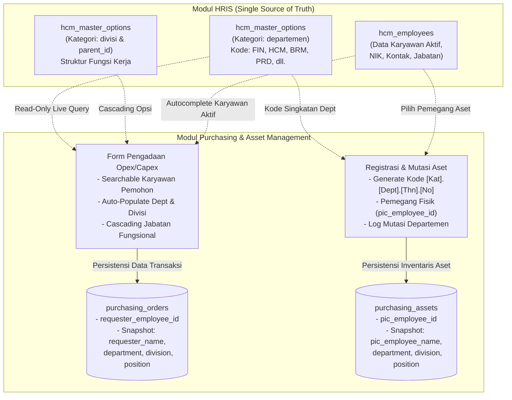

# Rencana Pengembangan Sistem Purchasing & Asset Management NISGroup
## Dokumen Blueprint Teknis, Arsitektur Data, dan Alur Kerja Operasional

Dokumen ini merupakan perencanaan teknis, arsitektur data, logika bisnis, matriks persetujuan (*approval matrix*), dan skema implementasi komprehensif untuk modul **Purchasing & Asset Management** pada platform NISReport. Seluruh isi dokumen ini disusun, diverifikasi, dan disinkronkan secara mendalam berdasarkan dekonstruksi 100% dari berkas **`Blueprint Website Purchasing NIS.xlsx`** (mencakup 8 lembar kerja resmi: *Dashboard*, *Database*, *DropDown*, *Alur & Validasi*, *Business Rules*, *Kode Barang*, *Kontak Suplier*, dan *Struktur Fungsi Kerja*).

---

## 1. Hasil Audit & Matriks Keselarasan Blueprint (100% Verified)

Tabel berikut menunjukkan keselarasan faktual antara dokumen Blueprint Excel resmi dan spesifikasi teknis implementasi di NISReport:

| No | Lembar Kerja Excel | Konten / Fitur pada Excel | Status Audit | Penanganan Teknis pada Sistem NISReport |
| :--- | :--- | :--- | :---: | :--- |
| **1** | **`Dashboard`** | • Widget *Urgent & Action Needed* (Tagihan TOP hari ini, Overdue, Pending Approvals, Stok kritis)<br>• Widget *Upcoming Schedules* (Garansi aset sisa 2 hari, software sisa 4 hari, minimum stock)<br>• Skema 5 Warna UX (*Red, Yellow/Amber, Blue, Green, Grey*) | **100% Cocok** | Diimplementasikan pada widget dashboard `/purchasing` menggunakan card-based alert system, reactive badge, sound chime, dan scheduled background job. |
| **2** | **`Database`** | • Master Log Pembelian Operasional (19 Kolom)<br>• Master Log Inventaris Aset Tetap (22 Kolom)<br>• Master Log Sistem Termin / TOP (9 Kolom)<br>• Master Log Aset Retirement (14 Kolom)<br>• Master Log Pemakaian Harian Material Khusus (Kain Putih, Kertas, Tinta) | **100% Cocok** | Dikonversi menjadi tabel database InnoDB ter-normalisasi: `purchasing_orders`, `purchasing_payments`, `purchasing_assets`, `purchasing_asset_retirements`, `purchasing_material_stocks`, dan `purchasing_material_usages`. |
| **3** | **`DropDown `** | • 14 Kategori Dropdown dinamis (Posisi dari HRIS, 5 Lokasi Ruko, 30 Kategori Item, 385+ Nama Item, 23 Satuan, 4 Kategori Vendor, 7 Jenis Transaksi, 10 Status Pembelian, 29 Kategori Aset, 13 Satuan Aset, 15 Alasan Retirement, 10 Kondisi Akhir, 12 Metode Pelepasan, 8 Varian Tinta) | **100% Cocok** | Dikelola melalui antarmuka *Vertical Tab Menu* mandiri (`/purchasing/master-data`) berbasis tabel `purchasing_master_options` (*zero code deployment*). |
| **4** | **`Alur & Validasi`** | • Alur 1: Pembelian Operasional Harian (Opex)<br>• Alur 2: Pembelian Aset Tetap (Capex)<br>• Alur 3: Asset Retirement (Pelepasan/Penjualan)<br>• Alur 4: Pencatatan Material Khusus<br>• Prinsip *Double Sign-Off* (Purchasing & Finance) | **100% Cocok** | Diterapkan menggunakan State Machine formal dengan status kode: `PENDING_PIC_CHECK`, `APPROVED_BY_PIC`, `PENDING_FINANCE_APPROVAL`, `PURCHASE_COMPLETED`, `PENDING_DOCUMENT_CHECK`, `APPROVED_ASSET_BUDGET`, `ASSET_REGISTERED`, `DRAFT_RETIREMENT`, `PENDING_SALE_APPROVAL`, `RETIRED_COMPLETED`, `STOCK_LOG_ACTIVE`, dan `SYNCED_TO_FINANCE`. |
| **5** | **`Business Rules`** | • Pemisahan Capex vs Opex<br>• Filter Rekapitulasi Divisi & Lokasi Ruko<br>• Penyesuaian Nilai Sisa Buku (*Book Value*) & Pengurangan Unit Real-Time saat Aset Pensiun<br>• Formula Bahan Putih: $\text{Stok Akhir} = \text{Stok Awal} + \text{Masuk} - \text{Keluar}$<br>• Reorder Alert jika $\text{Stok Akhir} \le \text{Threshold}$<br>• Bahan Warna: Sekali habis tanpa rekap harian<br>• 4 Halaman Laporan Khusus Terpisah<br>• **Purchase History Search & Re-order Info** (Keyword matching & linked vendor) | **100% Cocok** | Diterapkan di layer Service (`PurchasingCalculationService` & `MaterialStockService`), Observer mutasi aset, modul pencarian katalog historis, serta 4 dedicated tab views. |
| **6** | **`Kode Barang `** *(Baru)* | • Format Kode Aset: `[Kategori].[Dept].[Tahun3Digit].[Urut3Digit]` (Contoh: `IT.HCM.026.001`)<br>• Alur Pendaftaran Aset 2 Tahap (*Quick 2-Step Registration*)<br>• Mutasi Aset (Regenerasi kode & log riwayat audit kepemilikan)<br>• Tambah Master Kategori & Departemen Dinamis<br>• Search Box & Multi-Filter Aset<br>• *Smart Suggestion* (Rekomendasi kategori otomatis berbasis keyword)<br>• *Clickable Asset Code* (Modal popup detail riwayat aset & servis)<br>• Master 20 Kode Kategori Aset & 7 Kode Departemen Resmi | **100% Cocok** | Diterapkan pada `PurchasingAssetCodeService`, tabel `purchasing_asset_mutations`, kamus keyword `purchasing_asset_suggestions`, dan modal popup drawer detail aset di React. |
| **7** | **`Kontak Suplier`** *(Baru)* | • Hak Akses CRUD Suplier Khusus Admin Purchasing<br>• Validasi Pencegahan Duplikasi Nama Perusahaan/Toko<br>• Relasi Foreign Key ke Pembelian & Pencatatan Aset<br>• Dukungan **Multi-PIC / Banyak Kontak per Suplier** (One-to-Many Contacts: Sales, Finance, PIC baru)<br>• Penanda **Kontak Utama (*Primary Contact*)**<br>• Fleksibilitas Update Nomor/Email PIC Kapan Saja | **100% Cocok** | Diterapkan pada tabel relasional `purchasing_vendors` & `purchasing_vendor_contacts`, form repeater multi-kontak di UI React, dan validasi Eloquent. |
| **8** | **`Struktur Fungsi Kerja `** *(Baru)* | • Struktur Organisasi Resmi NIS Group (Hirarki Departemen $\rightarrow$ Divisi $\rightarrow$ Posisi Jabatan)<br>• 6 Entitas Departemen & Divisi Resmi: Finance, HCM, Marketing, Produksi, Media Internal, Media Eksternal<br>• Pemetaan 22 Posisi Fungsional Terikat per Divisi (Mengurai dekonstruksi 28 entri posisi pada sheet DropDown)<br>• Cascading Dropdown Dependency: Posisi pemohon terfilter otomatis sesuai divisi pemohon pada form pengadaan & alokasi aset | **100% Cocok** | Mengoptimalkan integrasi parent-child hierarchy pada modul HRIS (`hcm_master_options` dengan `parent_id`), memastikan keselarasan penuh pembebanan anggaran antar-divisi dan pengawasan aset. |

---

## 2. Visi Arsitektur, Isolasi Modul & Batasan Sistem

### A. Prinsip Non-Interference (Isolasi Mutlak dari Modul Lain)
Modul Purchasing dirancang mandiri tanpa risiko merusak (*zero breaking changes*) modul eksisting:
1. **Pemisahan Namespace & Database**:
   - Backend: `App\Http\Controllers\Purchasing\*`, `App\Models\Purchasing\*`, `App\Services\Purchasing\*`.
   - Frontend: `resources/js/Pages/Purchasing/*`.
   - Database: Menggunakan tabel baru berawalan `purchasing_*`. Tidak ada modifikasi skema (*alter table*) pada tabel-tabel milik modul lain (`hcm_*`, `orders`, `productions`, `invoices`, `refunds`, `users`).
2. **Titik Temu ke Modul HRIS: Sinkronisasi Departemen, Divisi, Posisi & Karyawan (Single Source of Truth - Read-Only)**:
   - Modul Purchasing **TIDAK MENGELOLA / TIDAK MEMBUAT MASTER DATA DEPARTEMEN, DIVISI, POSISI, MAUPUN KARYAWAN SENDIRI**. Seluruh data struktur organisasi dan profil personal dipusatkan di modul HRIS (*Single Source of Truth*).
   - **A. Sinkronisasi Departemen Resmi**:
     - Modul Purchasing menarik daftar nama departemen beserta kode singkatannya (`FIN`, `HCM`, `BRM`, `SCP`, `PRD`, `MIN`, `MEX`) melalui query read-only: `App\Models\Hcm\HcmMasterOption::getDepartmentsWithCodes()`.
     - Kode departemen ini menjadi komponen baku segmen ke-2 dalam standarisasi kodifikasi aset tetap `[Kategori].[Dept].[Tahun3Digit].[Urut3Digit]` (contoh: `IT.FIN.026.001`).
     - *Zero Maintenance / Dynamic*: Jika admin HRIS menambahkan departemen baru di menu **HRIS $\rightarrow$ Master Data**, sistem Purchasing otomatis mengenali nama dan kode departemen tersebut secara instan tanpa perlu perubahan skema database atau *hardcoding*.
   - **B. Sinkronisasi Divisi Operasional**:
     - Modul Purchasing membaca hierarki divisi operasional di bawah naungan departemen terkait melalui relasi `parent_id` pada tabel `hcm_master_options`.
     - Data pemetaan departemen-ke-divisi diperoleh secara dinamis dari `HcmMasterOption::getAllDropdowns()['department_division_map']`.
   - **C. Sinkronisasi Posisi / Jabatan Fungsional (Cascading Form)**:
     - Sesuai lembar kerja resmi *Struktur Fungsi Kerja* pada Excel Blueprint, posisi jabatan fungsional terikat secara hierarkis ke divisinya.
     - Form pengadaan pada UI Purchasing menerapkan *cascading dependent dropdown*: saat pemohon memilih Departemen & Divisi, opsi Posisi otomatis tersaring secara reaktif (contoh: saat memilih Divisi Produksi, dropdown Posisi hanya menampilkan 11 posisi yang relevan seperti *Jahit*, *Potong Bahan*, *Setting Printing*, *QC*, dll.).
   - **D. Sinkronisasi Data Karyawan Pemohon & Penanggung Jawab Aset**:
     - **Pencarian Real-Time Karyawan Aktif**: Form transaksi pengadaan dan mutasi aset menyediakan *searchable select* karyawan aktif dari modul HRIS (`App\Models\Hcm\HcmEmployee::where('is_active', true)`). Pencarian dapat dilakukan berdasarkan nama lengkap, nama panggilan, atau NIK/kode karyawan.
     - **Auto-Populate Profil**: Saat seorang karyawan dipilih sebagai pemohon (*requester*) atau pemegang aset (*asset custodian*), kolom Departemen, Divisi, dan Posisi pada formulir otomatis terisi (*auto-populated*) sesuai profil aktif karyawan tersebut di HRIS.
     - **Strategi Persistensi Ganda (Foreign Key & Immutable Snapshot)**:
       - *Foreign Key*: Menyimpan relasi referensial opsional `requester_employee_id` (pada PO) dan `pic_employee_id` (pada Aset) yang merujuk ke `hcm_employees.id`.
       - *Immutable Data Snapshot*: Sistem juga menyimpan kolom teks statis `requester_name`, `department`, `division`, dan `position` pada saat transaksi disubmit.
       - **Prinsip Audit Finansial (*Accounting Audit Integrity*)**: Jika di masa mendatang karyawan tersebut mengalami promosi jabatan, mutasi divisi, atau berhenti kerja (*resigned/offboarded*), riwayat transaksi pembelian dan pengeluaran kas lampau di pembukuan **TETAP KONSISTEN & TIDAK BERUBAH**.
3. **Pemanfaatan Layanan Bersama (Shared Core Services)**:
   - **Audit Trail Terpusat**: Menggunakan `App\Services\ActivityLogger::log($action, 'purchasing', $model, $desc)`.
   - **Sistem Notifikasi Multi-Channel**: Menggunakan `App\Notifications\SystemEventNotification` (In-App database, WhatsApp, Telegram, Email, Sound Bell).
   - **RBAC (Role-Based Access Control)**: Menggunakan Spatie Permission yang terintegrasi di `RolePermissionSeeder.php`.

---

### B. Prinsip Double Sign-Off Governance (Pemisahan Tugas Finansial)
Berdasarkan sheet *Alur & Validasi*, setiap transaksi pengadaan dan pelepasan aset tunduk pada pemisahan kewenangan (*Segregation of Duties*):

```
[Divisi Pemohon / PIC] ──> Pengajuan Barang / Aset via Sistem / WA
                                      ↓
[Purchasing Staff]     ──> Verifikasi Item, Spesifikasi, Vendor, Harga ──> [Status: PENDING_FINANCE_APPROVAL]
                                      ↓
[Finance / Keuangan]   ──> Audit Anggaran & Ketersediaan Kas          ──> [Tombol: "Approve Budget"]
                                      ↓
[Purchasing Staff]     ──> Eksekusi Pembelian Fisik & Upload Nota     ──> [Status: PURCHASE_COMPLETED]
                                      ↓
[Finance / Keuangan]   ──> Pencocokan Nota Asli & Pencairan Kas/Bank   ──> [Tombol: "Sign & Paid"]
                                      ↓ (Status: PAID_COMPLETED)
                               [Kunci Permanen / Read-Only]
```

1. **Purchasing Role (Gatekeeper Operasional & Fisik)**:
   - Menerima dan memverifikasi kebutuhan pengadaan dari unit kerja/ruko.
   - Menguji kewajaran harga ke supplier/vendor, memvalidasi spesifikasi fisik saat barang sampai di gudang, dan menginput inventaris fisik aset serta pemakaian bahan harian di web.
2. **Finance Role (Gatekeeper Dana & Anggaran)**:
   - Memvalidasi alokasi anggaran (*budget clearance*), memeriksa kesesuaian fisik invoice/nota dengan pengajuan, dan mengeksekusi pencairan dana (kas kecil, transfer bank, e-wallet, QRIS, atau pembayaran termin TOP).
3. **Aturan Validasi Mutlak (Double Sign-Off Rule)**:
   - Transaksi pembelian ataupun penjualan aset pensiun **tidak sah dan tidak berstatus Closed** sebelum Tim Keuangan memvalidasi dan menekan tombol persetujuan/pembayaran di sistem.

---

### C. Pedoman Engineering, Keamanan & Kualitas Kode (Clean Code Standard)

Sesuai instruksi baku arsitektur sistem NISReport, modul Purchasing & Asset Management wajib memenuhi standar kepatuhan teknis berikut:

#### 1. Pencegahan N+1 Query Problem (Zero N+1 Queries)
- **Eager Loading Wajib**: Seluruh relasi Eloquent wajib dimuat di awal menggunakan `with([...])` pada query controller/service (misal: `with(['vendor.contacts', 'requester', 'location', 'category', 'payments', 'mutations'])`).
- **Agregasi Efisien**: Menggunakan `withCount()`, `withSum()`, `withAvg()`, atau `withExists()` daripada melakukan query iteratif di dalam loop/map.
- **Strict Pagination**: Seluruh listing tabel data diwajibkan menggunakan pagination (`paginate(20)` atau `cursorPaginate()`) dengan pengindeksan kolom filter (`transaction_date`, `status`, `department`, `location_id`, `uuid`).
- **Verifikasi Query**: Setiap endpoint diuji menggunakan automated test dan log query (`DB::enableQueryLog()`) untuk menjamin jumlah query konstan/flat dan tidak berlipat ganda terhadap jumlah data.

#### 2. Larangan Penggunaan ID Numerik Database pada URL (Non-ID Base URL)
- **Zero Raw DB ID Exposure**: Tidak boleh ada endpoint atau URL yang menampilkan ID numerik auto-increment database (seperti `/purchasing/orders/1`, `/purchasing/assets/5`). Hal ini untuk mencegah serangan *ID Enumeration* dan *Insecure Direct Object Reference (IDOR)*.
- **Route Key Wajib Menggunakan Kode Bisnis atau UUID**:
  - `purchasing_orders`: Menggunakan nomor PO unik (`po_number`, contoh: `/purchasing/orders/PO-202603-0001`) atau `uuid` (`/purchasing/orders/{order:uuid}`).
  - `purchasing_assets`: Menggunakan kode aset unik (`asset_code`, contoh: `/purchasing/assets/IT.HCM.026.001`) atau `uuid` (`/purchasing/assets/{asset:uuid}`).
  - `purchasing_vendors`: Menggunakan kode vendor unik (`vendor_code`, contoh: `/purchasing/vendors/VND-001`) atau `uuid`.
  - `purchasing_payments`: Menggunakan `uuid` (`/purchasing/payments/{payment:uuid}`).
  - `purchasing_material_stocks`: Menggunakan `code` / `slug` unik (`/purchasing/materials/{material:code}`).
  - `purchasing_master_options`: Menggunakan `code` atau kategori (`/purchasing/master-data/{category}`).
- **Route Model Binding**: Setiap Model Eloquent di modul Purchasing mendefinisikan kolom `uuid` (CHAR 36) berindeks unik dan menyetel `getRouteKeyName()` sesuai identifikasi publiknya.

#### 3. Standar Ikon & Larangan Penggunaan Emoji Sembarangan
- **Zero Raw Emojis**: Dilarang keras menggunakan karakter emoji mentah pada UI antarmuka, label form, breadcrumb, controller, maupun basis data.
- **Modern Lucide SVG Icons**: Seluruh antarmuka menggunakan pustaka ikon modern resmi NISReport (`lucide-react`), seperti:
  - Menu Purchasing: `ShoppingBag`
  - Dashboard & Alert Center: `LayoutDashboard`
  - Pembelian Operasional: `FileText`
  - Termin / TOP: `CreditCard`
  - Aset Tetap: `Package` / `Box`
  - Pelepasan Aset: `Archive`
  - Material Khusus: `Layers`
  - Direktori Suplier / Vendor: `Building2`
  - Master Data & Kode: `SlidersHorizontal`
  - Laporan & Riwayat Pencarian: `BarChart3`
- Ikon ditampilkan dengan ukuran proporsional (16px–20px), tata letak rapi, dan warna harmoni yang elegan (*slate*, *emerald*, *amber*, *rose*).

#### 4. Clean Code & SOLID Architecture
- **Slim Controller**: Controller hanya bertindak sebagai orkestrator HTTP request dan response Inertia.
- **Service Layer Pattern**: Seluruh kalkulasi matematika, generator kode aset berjenjang, mutasi stok harian, penyusutan aset, pencarian riwayat katalog, dan mutasi vendor dieksekusi di Service khusus:
  - `PurchasingOrderService`
  - `PurchasingPaymentService`
  - `PurchasingAssetService`
  - `PurchasingAssetCodeService` (Generator `[Kategori].[Dept].[Tahun3Digit].[Urut3Digit]` & Log Mutasi)
  - `PurchasingMaterialStockService`
  - `PurchasingCalculationService`
  - `PurchasingVendorService` (Pengelolaan multi-kontak & validasi unik)
- **FormRequest Terdedikasi**: Seluruh input form divalidasi dan disanitasi menggunakan kelas FormRequest (misal: `StorePurchasingOrderRequest`, `StorePurchasingAssetRequest`, `MutatePurchasingAssetRequest`, `StorePurchasingVendorRequest`).
- **Resource / DTO Transformasi**: Data yang dikirim ke props Inertia React melalui transformasi konsisten untuk mencegah kebocoran data sensitif (*over-fetching*).

#### 5. Protokol Keamanan Tingkat Tinggi (Enterprise Security Guidelines)
- **Otorisasi Berbasis Kebijakan (RBAC & Policy)**: Setiap aksi controller wajib diverifikasi melalui Spatie Permission atau Laravel Policy (`$this->authorize(...)`).
- **Perlindungan Mass-Assignment**: Seluruh model wajib mendefinisikan array `$fillable` secara eksplisit dan ketat. Dilarang keras menggunakan `$guarded = []`.
- **Pencegahan SQL Injection**: Seluruh query menggunakan parameter binding Eloquent / Query Builder. Dilarang keras menyusun query SQL mentah via konkatenasi string.
- **Pencegahan Cross-Site Scripting (XSS)**: Memanfaatkan escaping otomatis React JSX dan sanitasi input teks sebelum persistensi.
- **Perlindungan CSRF**: Seluruh mutasi HTTP (POST, PUT, PATCH, DELETE) dilindungi token CSRF Inertia.
- **Keamanan Unggah Berkas Digital (Nota & Dokumen)**:
  - Validasi MIME type ketat (`application/pdf`, `image/jpeg`, `image/png`).
  - Pembatasan ukuran berkas (maksimal 5MB).
  - Berkas disimpan di storage privat menggunakan nama acak yang aman (*hashed filename* via `Str::random(40)`), tidak pernah menggunakan nama asli file dari pengguna.

#### 6. Disiplin Pengerjaan Bertahap (Strict Phase-Gate Execution)
- **Pengerjaan Wajib Per Fase**: Tim pengembang dilarang keras berpindah ke fase berikutnya sebelum seluruh deliverable (skema database, model, controller, form request, service, UI React, audit log, RBAC, dan unit/feature test) pada fase yang sedang berjalan **selesai 100% dan teruji**.
- **Kemandirian Sub-Modul**: Setiap sub-modul harus berdiri sempurna tanpa *mocking* yang tertunda sebelum sub-modul berikutnya disentuh.

---

### D. Integrasi Navigasi Menu Sidebar "Purchasing & Aset"
Sistem diintegrasikan ke navigasi utama sistem (`resources/js/Layouts/SidebarContent.jsx`) sebagai kelompok menu tersendiri (**"Purchasing & Aset"**):

```
[ SIDEBAR NISREPORT ]
├── Utama (Dashboard)
├── Administrasi (Brand, Target, User, Role)
├── Master Data (Produk, Pelanggan, Kategori)
├── Produksi (Order, Kanban, Tracking)
├── Keuangan (Arus Kas, Tagihan, Piutang)
├── Kepegawaian (HRIS / HCM)
│
└── PURCHASING & ASET [Icon: ShoppingBag]
    ├── Dashboard & Alert Center     (route: 'purchasing.dashboard', icon: LayoutDashboard)
    ├── Pembelian Operasional (Opex) (route: 'purchasing.orders.index', icon: FileText)
    │   ├── Pengajuan Pembelian Harian
    │   └── Log Transaksi & Arsip Nota Digital
    ├── Termin & Jatuh Tempo (TOP)   (route: 'purchasing.payments.index', icon: CreditCard)
    │   ├── Monitoring Tagihan Jatuh Tempo (Hari Ini / Overdue)
    │   └── Jadwal Cicilan Termin Vendor
    ├── Manajemen Aset Tetap (Capex) (route: 'purchasing.assets.index', icon: Package)
    │   ├── Quick 2-Step Registration (Generate Kode & Deep Info)
    │   ├── Master Inventaris & Clickable Detail Drawer
    │   ├── Mutasi Departemen & Audit History
    │   └── Pelepasan Aset (Retirement) (route: 'purchasing.assets.retirement', icon: Archive)
    ├── Material Khusus & Stok       (route: 'purchasing.materials.index', icon: Layers)
    │   ├── Stok & Pemakaian Kain Putih
    │   ├── Rekap Pembelian Kain Warna
    │   ├── Stok & Pemakaian Kertas
    │   └── Stok & Pemakaian Tinta
    ├── Direktori Supplier / Vendor  (route: 'purchasing.vendors.index', icon: Building2)
    │   ├── Profil Suplier & Multi-PIC Contacts
    │   └── Penanda Primary Contact & Riwayat
    ├── Master Data & Kode           (route: 'purchasing.master-data.index', icon: SlidersHorizontal)
    │   ├── Master Dropdown Dinamis
    │   ├── Master Kategori & Departemen Aset
    │   └── Kamus Smart Suggestion Keyword
    └── Laporan & Riwayat Pembelian  (route: 'purchasing.reports.index', icon: BarChart3)
        ├── Purchase History Search & Re-order Info
        └── Rekapitulasi Biaya Opex/Capex per Divisi & Ruko
```

---

## 3. Matriks Alur Kerja & Status Sistem (Workflow Matrix)

Sesuai sheet **`Alur & Validasi`** dan **`Kode Barang `** pada Blueprint, berikut 5 alur kerja formal beserta kode status dan gerbang validasi (*validation gate*):

### Alur 1: Pembelian Operasional Harian (Opex)
| No | Tahapan Proses | User / Role | Aksi & Pemicu | Kode Status Sistem | Aturan Validasi (*Gate*) | Tindakan Lanjutan |
| :---: | :--- | :--- | :--- | :--- | :--- | :--- |
| **1** | Request Intake | Purchasing Staff | Menerima pengajuan pembelian operasional via WA/form dari divisi/ruko | `PENDING_PIC_CHECK` | Wajib melampirkan rincian item, jumlah, estimasi biaya, dan tujuan penggunaan. | Mengajukan verifikasi ke PIC divisi terkait. |
| **2** | PIC Approval | PIC Divisi Terkait | Memeriksa dan menyetujui barang operasional yang diajukan | `APPROVED_BY_PIC` | Jika ditolak wajib menyertakan alasan penolakan tertulis. | Masuk ke antrean verifikasi anggaran Purchasing & Keuangan. |
| **3** | Web Input & Finance Approval | Purchasing / Keuangan | Purchasing input ke web, Keuangan mereview anggaran | `PENDING_FINANCE_APPROVAL` | Keuangan mencocokkan ketersediaan kas (kas kecil / transfer terjadwal). | Anggaran dikunci; Purchasing siap mengeksekusi pembelian. |
| **4** | Payout & Execution | Purchasing / Keuangan | Keuangan mencairkan dana $\rightarrow$ Purchasing membeli barang | `PURCHASE_COMPLETED` | Wajib mengunggah nota/struk belanja asli ke sistem web untuk dicocokkan Keuangan. | Verifikasi akhir Keuangan $\rightarrow$ Status `PAID_COMPLETED`. |

### Alur 2: Pembelian & Registrasi Aset Tetap (Capex 2-Step Registration)
| No | Tahapan Proses | User / Role | Aksi & Pemicu | Kode Status Sistem | Aturan Validasi (*Gate*) | Tindakan Lanjutan |
| :---: | :--- | :--- | :--- | :--- | :--- | :--- |
| **1** | Formal Request & Logging | Purchasing Staff | Menerima pengajuan pembelian aset dengan dokumen resmi | `PENDING_DOCUMENT_CHECK` | Wajib mengunggah dokumen PDF/berkas pengajuan aset bertanda tangan pemohon. | Diajukan ke Keuangan dan Direksi. |
| **2** | Finance & Management Approval | Keuangan / Direksi | Audit kelayakan anggaran dan urgensi pengadaan aset | `APPROVED_ASSET_BUDGET` | Dana investasi aset dikunci (*budget locked*). | Purchasing menerbitkan PO resmi ke vendor. |
| **3** | **Tahap 1: Quick Registration** | Purchasing Staff | Memilih Kategori & Departemen $\rightarrow$ Sistem generate kode unik otomatis | `ASSET_CODE_GENERATED` | Format baku `[Kategori].[Dept].[Tahun3Digit].[Urut3Digit]` (contoh: `IT.HCM.026.001`). Nomor urut dikunci. | Kode placeholder aktif dan siap ditempelkan/dicatat. |
| **4** | **Tahap 2: Deep Information** | Purchasing Staff | Barang fisik datang, nota/invoice keluar $\rightarrow$ Membuka aset untuk mengisi data lengkap | `ASSET_REGISTERED` | Nomor seri, masa garansi, spesifikasi, lokasi ruko, vendor, foto nota/kartu garansi wajib lengkap. | Aset aktif digunakan dan masuk jadwal monitoring pemeliharaan. |

### Alur 3: Mutasi & Perpindahan Aset Antar-Departemen
| No | Tahapan Proses | User / Role | Aksi & Pemicu | Kode Status Sistem | Aturan Validasi (*Gate*) | Tindakan Lanjutan |
| :---: | :--- | :--- | :--- | :--- | :--- | :--- |
| **1** | Pengajuan Mutasi | Admin / PIC Divisi | Buka profil aset, klik tombol "Mutasi Aset", pilih departemen tujuan baru | `PENDING_MUTATION` | Wajib menyertakan departemen tujuan, PIC penerima baru, tanggal mutasi, dan alasan perpindahan. | Sistem memvalidasi kesiapan regenerasi kode. |
| **2** | Eksekusi & Regenerasi Kode | Purchasing Staff | Konfirmasi mutasi fisik aset di web | `MUTATION_COMPLETED` | Sistem otomatis meregenerasi kode aset menyesuaikan departemen baru (contoh: `IT.HCM.026.001` $\rightarrow$ `IT.FIN.026.001`). Data riwayat perolehan awal tidak terhapus. | Sistem mencatat tabel riwayat kepemilikan (`purchasing_asset_mutations`) untuk audit trail. |

### Alur 4: Asset Retirement (Pelepasan / Pensiun Aset)
| No | Tahapan Proses | User / Role | Aksi & Pemicu | Kode Status Sistem | Aturan Validasi (*Gate*) | Tindakan Lanjutan |
| :---: | :--- | :--- | :--- | :--- | :--- | :--- |
| **1** | Physical Check & Status | Purchasing Staff | Memeriksa kondisi fisik aset di lapangan untuk menentukan status pelepasan | `DRAFT_RETIREMENT` | Menentukan metode pelepasan (dijual, dibuang, ditarik gudang, kanibal, dll.). | Jika opsi dijual, wajib mengajukan persetujuan finansial. |
| **2** | Financial Approval (Jual) | Tim Keuangan | Menganalisis nilai sisa buku (*Book Value*) dan estimasi harga jual | `PENDING_SALE_APPROVAL` | Keuangan menyetujui/menolak rencana harga pelepasan aset. | Jika disetujui, diteruskan kembali ke Purchasing untuk eksekusi. |
| **3** | Execution & System Archive | Purchasing Staff | Mengeksekusi penjualan/pelepasan dan memperbarui status aset di web | `RETIRED_COMPLETED` | Hasil penjualan masuk kas perusahaan, nilai buku otomatis dipotong, status aset diarsipkan (*archived*). | Terbit Berita Acara Pelepasan Aset untuk arsip audit. |

### Alur 5: Pencatatan Material Khusus (Kain, Kertas, Tinta)
| No | Tahapan Proses | User / Role | Aksi & Pemicu | Kode Status Sistem | Aturan Validasi (*Gate*) | Tindakan Lanjutan |
| :---: | :--- | :--- | :--- | :--- | :--- | :--- |
| **1** | Stok Input & Log Harian | Purchasing Staff | Mencatat keluar-masuk stok khusus (Kain Putih, Kain Warna, Kertas, Tinta) | `STOCK_LOG_ACTIVE` | Input transaksi harian terpusat hanya melalui hak akses role Purchasing. | Data tersimpan real-time di database. |
| **2** | System Sync & Audit | Sistem (Web Purchasing) | Sinkronisasi otomatis kuantitas fisik dan nilai moneter dengan Keuangan | `SYNCED_TO_FINANCE` | Mencegah selisih inventaris fisik gudang dengan kas/utang dagang. | Dipakai sebagai dasar laporan stok dan *Reorder Alert* otomatis. |

---

## 4. Logika Bisnis & Perhitungan Otomatis (Business Rules)

Sesuai sheet **`Business Rules`**, **`Kode Barang `**, dan **`Kontak Suplier`** pada Blueprint, backend menerapkan formula dan aturan otomatis berikut:

### A. Formula Nilai Pembelian & Anggaran Divisi
1. **Perhitungan Nilai Pembelian**:
   $$\text{Subtotal} = \text{Quantity} \times \text{Harga Satuan}$$
   $$\text{Grand Total} = \text{Subtotal} - \text{Diskon} + \text{Ongkos Kirim} + \text{PPN/Pajak}$$
2. **Pemisahan Pengeluaran Opex vs Capex**:
   - Sistem memisahkan akumulasi pengeluaran belanja operasional habis pakai (*Opex*) dan belanja aset tetap (*Capex*).
   - Pengeluaran dapat difilter per Divisi Pemohon (HCM, Produksi, Marketing, Setting-Print, dll.) dan Lokasi Fisik Ruko/Gudang (Laras Liris, Walisongo, Artomoro, Green HCM, Green Admin).
3. **Penyesuaian Nilai Aset Real-Time (*Asset Retirement Impact*)**:
   - Bila aset berstatus `RETIRED`, sistem otomatis memotong **Total Nilai Buku Aset Perusahaan** sebesar Nilai Sisa Buku aset tersebut dan mengurangi **Jumlah Unit Fisik Aktif** secara real-time pada dashboard eksekutif.

### B. Logika Stok Bahan Baku Kritis
1. **Material dengan Input Pemakaian Harian (Contoh: Kain Putih)**:
   $$\text{Stok Akhir} = \text{Stok Awal} + \text{Pembelian Masuk Harian} - \text{Pemakaian Keluar Harian}$$
   - Purchasing dapat mengatur batas minimal stok (*Minimum Threshold*, misal 10 Roll).
   - Jika $\text{Stok Akhir} \le \text{Batas Minimal}$, sistem otomatis memicu **Red Alert** di dashboard dan WhatsApp untuk reorder darurat.
2. **Material Sekali Habis (Contoh: Kain Warna)**:
   - Sifat barang: Dibeli untuk kebutuhan proyek spesifik dan langsung habis pakai ke divisi potong/jahit.
   - Pencatatan: Tidak ada form pemakaian harian fisik, sistem hanya mencatat rekap pembelian masuk (*Inbound Purchase Log*) dan riwayat distribusinya.
3. **Pemisahan 4 Laporan Mandiri di Web (*Dedicated Reports*)**:
   - **Laporan 1**: Stok & Pemakaian Kain Putih (grafik sisa stok vs threshold).
   - **Laporan 2**: Rekap Pembelian Kain Warna (riwayat pengadaan & total biaya).
   - **Laporan 3**: Stok & Pemakaian Kertas (kontrol persediaan ATK sublim).
   - **Laporan 4**: Stok & Pemakaian Tinta (kontrol per varian warna & maintenance).

### C. Modul Riwayat & Pencarian Spesifikasi Pembelian (Purchase History Search)
Sesuai sheet *Business Rules* baris R27–R35:
1. **Keyword Matching**: Staf dapat mengetik kata kunci spesifik (merek, tipe, nama barang, nomor PO) pada kotak pencarian riwayat pembelian untuk melacak transaksi masa lalu secara instan tanpa membuka arsip fisik atau chat WhatsApp lama.
2. **Informasi Lengkap Transaksi**: Setiap item pada hasil pencarian menampilkan nama barang, spesifikasi lengkap, tanggal pembelian terakhir, harga perolehan, unit kerja pemohon, dan kode aset terkait (bila berupa aset).
3. **Informasi Suplier Terikat untuk Re-Order**: Sistem menampilkan nama toko/suplier, nomor telepon/WhatsApp PIC yang bersangkutan, serta tautan langsung ke suplier agar staf dapat melakukan *repeat order* dengan cepat dan akurat.

### D. Logika Kodifikasi Aset, Mutasi, dan Smart Suggestion (Sheet Kode Barang)
1. **Format Standar Kode Aset**:
   $$\text{Kode Aset} = \text{[Kode Kategori]} . \text{[Kode Departemen]} . \text{[Tahun 3 Digit]} . \text{[No Urut 3 Digit]}$$
   - **Contoh Riil**: `IT.HCM.026.001` (Kategori: Perangkat IT `IT`, Departemen: Human Capital Management `HCM`, Tahun 2026 `026`, Urutan `001`).
   - Nomor Urut 3 digit digenerate otomatis (*auto-increment*) berbasis kombinasi unik `category_code` + `department_code` + `year_code`.
2. **Aturan Mutasi Aset (Perubahan Kode & Preservation of History)**:
   - Jika aset berpindah departemen (misal laptop `IT.HCM.026.001` dipindah ke Finance `FIN`), kode aset otomatis diperbarui menjadi `IT.FIN.026.001` (atau nomor urut aktif berikutnya di departemen baru).
   - Riwayat kepemilikan sebelumnya **wajib tersimpan permanen** di tabel `purchasing_asset_mutations` dengan mencatat: `old_asset_code`, `new_asset_code`, `from_department`, `to_department`, `mutation_date`, `pic_user_id`, dan `notes`. Data perolehan awal tetap utuh demi kepentingan audit.
3. **Smart Suggestion Engine (Rekomendasi Kategori Otomatis)**:
   - Saat admin mengetik nama barang pada form pembelian/pendaftaran aset (misal: "Laptop ThinkPad", "Mesin Jahit Juki", "Meja Resepsionis"), sistem melakukan pencocokan kata kunci (*keyword matching*) terhadap kamus kata kunci di database (`purchasing_asset_suggestions`).
   - Sistem memunculkan dropdown saran kategori aset yang cocok (misal: mengetik "Laptop" langsung menyarankan kategori `IT` - Perangkat IT; mengetik "Meja" menyarankan `FRN` - Furniture & Fixture).
4. **Interaksi Clickable Asset Code**:
   - Seluruh tampilan kode aset di Dashboard, tabel inventaris, dan riwayat pencarian disajikan sebagai tautan aktif (*clickable link*).
   - Mengklik kode aset akan membuka drawer/modal pop-up yang merangkum: (1) Spesifikasi & status pemegang saat ini, (2) Riwayat mutasi/perpindahan departemen, (3) Data finansial & masa garansi, dan (4) Riwayat pemeliharaan/servis (*Maintenance Log*).

### E. Aturan Bisnis Direktori Suplier & Multi-PIC (Sheet Kontak Suplier)
1. **Hak Akses Ketat**: Hanya pengguna dengan hak akses Admin Purchasing (`admin_purchasing`) yang memiliki wewenang membuat, memperbarui, atau menghapus data suplier.
2. **Validasi Anti-Duplikasi**: Sistem memvalidasi nama perusahaan/toko secara case-insensitive agar tidak terjadi pencatatan ganda.
3. **Dukungan Multi-PIC (Banyak Kontak per Suplier)**:
   - Satu entitas suplier dapat memiliki banyak kontak PIC (misalnya: PIC 1 Sales Utama, PIC 2 Finance Penagihan, PIC 3 Customer Service).
   - Kontak dapat ditambah atau diubah kapan saja tanpa merusak relasi histori transaksi.
4. **Penanda Primary Contact**:
   - Tepat satu kontak dalam daftar kontak suplier wajib ditandai sebagai **Kontak Utama (*Primary*)**.
   - Kontak utama ini yang akan ditampilkan pada dropdown pemesanan cepat dan detail order.

---

## 5. Sistem Alerting & Indikator Warna UX (Dashboard Blueprint)

Sesuai sheet **`Dashboard`**, sistem menerapkan *5-Tier Color-Coding Matrix*:

```
🔴 RED SYSTEM (Critical / Urgent / Immediate Action)
 ├── 1. TOP / Cicilan Jatuh Tempo Hari Ini (Immediate Payment Required)
 ├── 2. Keterlambatan Pembayaran (Overdue Payments)
 ├── 3. Pending Approvals (PR / Pengajuan Aset belum di-approve)
 └── 4. Stok Kritis / Habis (Bahan baku esensial <= Minimum Threshold)

🟡 AMBER / YELLOW SYSTEM (Warning / Upcoming Deadlines)
 ├── 1. Peringatan Jatuh Tempo Mendekati Hari H (H-3 s.d. H-1)
 ├── 2. Masa Garansi Aset Berakhir dalam 7 s.d. 30 hari ke depan
 ├── 3. Kontrak Sewa Ruko / Langganan Software habis dalam 30 hari
 └── 4. Pending Purchase Order (PO terkirim ke vendor tapi belum konfirmasi 2-3 hari)

🔵 BLUE SYSTEM (Information / Operational & Events)
 ├── 1. Pengiriman Barang Dalam Perjalanan (On Delivery / Shipped via kurir)
 ├── 2. Jadwal Pemeliharaan Aset (Servis berkala mesin / kendaraan)
 └── 3. Penerimaan Barang Gudang (Kedatangan barang baru menunggu cek fisik)

🟢 GREEN SYSTEM (Success / Completed / Milestones)
 ├── 1. Status Pembayaran Lunas (Paid & Verified by Finance)
 ├── 2. Penerimaan & Validasi Aset Selesai (Sukses masuk Master Aset)
 └── 3. Penyelesaian Retur / Klaim Garansi / Asuransi Selesai

⚪ GREY SYSTEM (Neutral / Inactive / History)
 ├── 1. History Pembayaran (Riwayat notifikasi tagihan lunas)
 ├── 2. Expired / Archived Items (Pengajuan PO dibatalkan atau ditolak)
 └── 3. Aset Berstatus Retirement (Aset non-aktif dari operasional)
```

---

## 6. Katalog Lengkap Master Data Dinamis & Standar Kode Resmi

Berikut daftar lengkap seluruh opsi master data yang diekstrak secara faktual dari sheet **`DropDown `**, **`Kode Barang `**, dan **`Kontak Suplier`**:

### A. Tabel Standar Kode Kategori Aset Resmi (Sheet Kode Barang)
| No | Nama Kategori Aset | Kode Kategori | Keterangan / Contoh Item |
| :---: | :--- | :---: | :--- |
| 1 | Tanah | `TNH` | Lahan, tanah pabrik, tanah kantor |
| 2 | Bangunan / Properti | `BGN` | Gedung kantor, pabrik, gudang, renovasi besar |
| 3 | Kendaraan | `KND` | Mobil operasional, motor kurir, truk logistik |
| 4 | Mesin & Peralatan Produksi | `MSN` | Mesin jahit industri, mesin potong, conveyor |
| 5 | Peralatan Kantor | `KTK` | Meja kerja, kursi, lemari arsip, brankas |
| 6 | Perangkat IT (Laptop / PC / Server) | `IT` | Laptop staff, PC workstation, server utama |
| 7 | Periferal IT (Printer / Scanner / Router) | `ITP` | Printer, scanner, switch, router, AP Wi-Fi |
| 8 | Furniture & Fixture | `FRN` | Sofa resepsionis, interior, lampu gantung, partisi |
| 9 | Peralatan Gudang | `GDG` | Hand pallet, rak heavy duty, tangga gudang |
| 10 | Peralatan Keamanan (CCTV / Alarm / APAR) | `KMN` | Kamera CCTV, mesin fingerprint, APAR, alarm |
| 11 | Peralatan Operasional (Tools) | `TLS` | Toolbox, bor tangan, obeng set, alat ukur |
| 12 | Aset Marketing / Branding | `MKT` | Banner permanen, neon box, booth pameran |
| 13 | Software / Lisensi | `SFT` | Lisensi software berbayar tahunan / perpetual |
| 14 | Aset Tidak Berwujud | `ATB` | Hak paten, hak cipta, legalitas merek |
| 15 | Perbaikan / Improvement (Capex) | `PRB` | Modifikasi besar aset yang menambah umur ekonomis |
| 16 | Infrastruktur & Instalasi | `INF` | Instalasi listrik pabrik, pipa air, penangkal petir |
| 17 | Peralatan Studio / Multimedia | `MDM` | Kamera DSLR, mic wireless, lampu studio |
| 18 | Peralatan Karyawan (HP / Tablet) | `KRY` | Smartphone operasional / tablet lapangan |
| 19 | Peralatan Pantry & Facility | `FAS` | Kulkas kantor, dispenser, AC ruang istirahat |
| 20 | Legal / Administratif | `LGL` | Dokumen legalitas berharga / arsip penting |

### B. Tabel Standar Kode Departemen Penanggung Jawab Aset (Tersinkronisasi 100% dari HRIS Master Data)
| No | Nama Departemen / Divisi (di HRIS) | Kode Departemen | Status di HRIS | Keterangan Alokasi |
| :---: | :--- | :---: | :---: | :--- |
| 1 | Human Capital Management | `HCM` | Aktif | Divisi kepegawaian, HR, & umum |
| 2 | Finance & Accounting | `FIN` | Aktif | Divisi keuangan, kas, akuntansi |
| 3 | Brand & Marketing | `BRM` | Aktif | Divisi promosi & pemasaran |
| 4 | Support & Control Produksi | `SCP` | Aktif | Tim pendukung & QC pabrik |
| 5 | Produksi | `PRD` | Aktif | Divisi manufaktur jahit, potong, sublim |
| 6 | Media Internal | `MIN` | Aktif | Tim kreatif & publikasi internal |
| 7 | Media Eksternal | `MEX` | Aktif | Tim konten & media eksternal |

> [!NOTE]
> **Prinsip Single Source of Truth**:
> Modul Purchasing **tidak membuat tabel master departemen sendiri**. Seluruh data departemen di atas tersimpan pada tabel `hcm_master_options` (kategori `divisi`) dan dibaca secara dinamis menggunakan `HcmMasterOption::getDepartmentsWithCodes()`. Jika perusahaan menambah departemen baru (misalnya `Research & Development` dengan kode `RND`) di menu **HRIS Master Data**, modul Purchasing secara otomatis menarik dan menampilkannya di formulir pembuatan kode aset, filter, maupun mutasi.

---

### C. Master Dropdown Operasional & Bisnis (Sheet DropDown)
1. **Posisi & Dekonstruksi Hirarki (Tersinkronisasi dengan Sheet Struktur Fungsi Kerja)**:
   - Daftar pada sheet *DropDown* memuat 28 entri yang merupakan gabungan nama Divisi dan Jabatan Fungsional.
   - Berdasarkan sheet *Struktur Fungsi Kerja*, entri tersebut didekonstruksi secara terstruktur menjadi:
     - **6 Entitas Divisi/Departemen Induk**: `Finance`, `Human Capital Management`, `Marketing`, `Produksi`, `Media Internal`, `Media Eksternal`.
     - **22 Jabatan Fungsional Spesifik**: `Accounting`, `Purchasing`, `Admin HCM`, `Admin Brand`, `Designer`, `Admin Produksi`, `Setting Printing`, `Potong Bahan`, `Press Sublime`, `Potong Pola`, `Jahit`, `Quality Control`, `Finishing (Press)`, `Finishing (Steam)`, `Finishing (Packing)`, `Operasional`, `Media Spesialist`, `Publisher`, `Editor`, `Planner`, `Web Editor`, `Web Developer`.
2. **Lokasi Ruko / Gudang (5 Opsi)**:
   `Laras Liris`, `Walisongo`, `Artomoro`, `Green HCM`, `Green Admin`.
3. **Kategori Item Pembelian (30 Opsi)**:
   `ATK`, `Consumable Printer / IT`, `Pantry / Konsumsi Kantor`, `Kebersihan Kantor`, `Maintenance / Perawatan`, `Operasional Kantor`, `Safety / K3`, `Kesejahteraan Karyawan`, `Printing / Percetakan`, `Kain Putih`, `Kain Warna`, `Jarum`, `Kancing`, `Size`, `DTF Size`, `Benang`, `Poliester`, `Resleting`, `Bawahan`, `Kerah`, `Woffin / Wishtag`, `Perlengkapan Jahit`, `Perlengkapan Steam`, `Polyflex`, `Kemasan`, `Sticker`, `Logo`, `Materi Marketing`, `Perlengkapan Packing`, `Perlengkapan QC`.
4. **Satuan Barang (23 Opsi)**:
   `Pcs`, `Box / Dus`, `Pack / Pak`, `Rim`, `Roll / Rol`, `Lusin`, `Kodi`, `Gross`, `Set`, `Botol`, `Galon`, `Jerigen`, `Pail / Drum`, `Sachet / Tube`, `Yard`, `Meter`, `Kilogram (Kg)`, `Roll`, `Bulan`, `Tahun / Year`, `Jam / Hari`, `Lembar / Sheet`, `Tabung`.
5. **Kategori Supplier / Vendor (4 Opsi)**:
   `E-Commerce / Marketplace Online`, `Pembelian Langsung / Offline`, `Vendor Kontrak / Langganan`, `Langganan Digital / Software`.
6. **Jenis Transaksi Pembayaran (7 Opsi)**:
   `Tunai / Kas Kecil (Cash / Petty Cash)`, `Transfer Bank (Bank Transfer / Virtual Account)`, `E-Wallet / Dompet Digital`, `QRIS`, `Kartu Kredit / Kartu Debit (Credit / Debit Card)`, `Tempo / Kredit (Term of Payment / TOP)`, `Reimburse / Dana Talangan Pribadi`.
7. **Status Pembelian (10 Opsi)**:
   `Draft`, `Menunggu Persetujuan (Pending Approval)`, `Disetujui (Approved)`, `Ditolak (Rejected)`, `Diproses / Dipesan (In Process / Ordered)`, `Sebagian Diterima (Partial Received)`, `Selesai / Barang Diterima (Completed / Received)`, `Menunggu Validasi Invoice / Keuangan (Pending Finance Verification)`, `Lunas (Paid)`, `Dibatalkan (Cancelled)`.
8. **Satuan Aset Tetap (13 Opsi)**:
   `Pcs`, `Unit`, `Set`, `Pasang (Pair)`, `Batang`, `Lembar / Sheet`, `Roll / Rol`, `Box / Dus`, `Pack / Pak`, `Paket / Project`, `Meter`, `Meter Persegi`, `Titik`.
9. **Alasan Aset Retirement (15 Opsi)**:
   `Rusak Berat (Tidak Layak Pakai)`, `Usang / Ketinggalan Teknologi`, `Biaya Perbaikan Terlalu Mahal`, `Dijual / Pelepasan Komersial`, `Hilang / Dicuri`, `Rusak karena Bencana / Kecelakaan`, `Masa Manfaat Habis`, `Ditukar Tambah`, `Dimusnahkan / Scrap Total`, `Pengembalian ke Pihak Ketiga`, `Hibah / Donasi ke Pihak Lain`, `Penutupan Lokasi / Ruko / Divisi`, `Hasil Temuan Audit / Penghapusan Fisik`, `Penurunan Kapasitas / Perubahan Fungsi Operasional`, `Cacat Produksi / Bawaan Pabrik`.
10. **Kondisi Akhir Aset (10 Opsi)**:
    `Sangat Baik (Seperti Baru / Mint Condition)`, `Baik (Berfungsi Normal / Pemakaian Normal)`, `Cukup / Layak Pakai (Ada Tanda Pemakaian / Minor Wear)`, `Rusak Ringan (Perlu Servis / Bisa Diperbaiki)`, `Rusak Sedang (Fungsi Terganggu / Sebagian Komponen Rusak)`, `Rusak Berat / Total (Tidak Dapat Berfungsi Sama Sekali)`, `Sisa Komponen Saja / Kanibalan (Spare Parts Only / Stripped)`, `Scrap / Besi Tua / Bahan Daur Ulang`, `Hilang Total (Tidak Ada Wujud Fisik)`, `Utuh & Layak Jual (Resaleable / Good for Secondary Market)`.
11. **Metode Pelepasan Aset (12 Opsi)**:
    `Lelang Terbuka / Publik`, `Penjualan Langsung / Negosiasi`, `Penjualan ke Karyawan`, `Tukar Tambah`, `Hibah / Donasi Amal`, `Pemusnahan / Penghancuran Total`, `Pengembalian ke Lessor / Vendor`, `Kanibalan Komponen`, `Klaim Asuransi`, `Dibuang / Dimusnahkan Langsung`, `Ditarik Kembali ke Gudang Pusat`, `Disimpan Sebagai Cadangan / Standby`.
12. **Varian Tinta & Maintenance (8 Opsi)**:
    `Cyan`, `Magenta`, `Yellow`, `Liquid Maintanance`, `Wipercloth`, `Flow Pink`, `Flow Yellow`, `Hitam`.
13. **Katalog Nama Item (385+ Opsi Terklasifikasi Berdasarkan Kategori)**:
    - **Kain Putih**: `(Putih) Airwalk`, `(Putih) Smash`, `(Putih) Milano Alle`, `(Putih) Milano Drive`, `(Putih) Topo`, `(Putih) Teraria`, `(Putih) Lotto Alle Halus`, `(Putih) Lotto Drive Kasar`, `(Putih) Waffle`, `(Putih) Straw`, `(Putih) Curly`, `(Putih) Pique`, `(Putih) Senna`, `(Putih) Olino`, `(Putih) Century`, `(Putih) Scuba`, `(Putih) Pales > Bendera`, `(Putih) Satin > Bendera`, `(Putih) Rib`, `(Putih) Dropnidel`, `(Putih) Evistra (Kemeja)`, `(Putih) Jaguar Tripel S`, `(Putih) Parasut`, `(Putih) Mikro DK Lite`, `(Putih) Monochrome`, `(Putih) Aktive Waffle`, `(Putih) Diadora Embis Mixed`, `(Putih) Diadora Polos`, `(Putih) Oscar Ashley`, `(Putih) Canvas`.
    - **Kain Warna**: Aneka varian Milano (Magenta, Fanta, Pink Muda, Pink Baby, Kubus 1&2, Gold, Army, Kuning Emas/Kenari, Italy, Navy, Benhur, Turqish, Biru Langit, Hijau TNI/Botol/Fuji/Mint, Toska Tua, Tosca 1&2, Orange Tua/Muda, Merah Hati/Cabe, Maroon, Ungu, Hitam, Abu Tua/Muda, Putih), Airwalk (Putih, Abu Muda/Tua, Hitam, Turqis, Benhur, Navy, Ungu, Tosca 1, Hijau Botol/Army/TNI/Fuji, Merah Cabe, Maroon), Topo (Putih, Hitam, Hijau Botol, Merah Cabe, Navy, Maroon, Benhur, Ungu), Waffle (Hitam, Merah Cabe, Turqish), Smash (Maroon, Hijau Botol, Navy, Hitam, Kuning Kenari), Scuba, Straw, Parasut, dll.
    - **Jarum & Alat Jahit**: Jarum Obras DC, Jarum Jahit DB, Jarum Overdex UY, Jarum Kansai UO, Jarum Rantai TV, Jarum Singer, Jarum Pasang Kancing TQ, Jarum Lubang Kancing DP, Sepatu Tindes, Sepatu Biasa, Sepatu 1 Kaki, Spool, Skoci, Obeng Jarum, Baut Jarum, Magnet Mesin, Minyak Mesin, Kapur Jahit, Gunting Potong Kain.
    - **Kancing**: Kancing Executive (Hitam, Putih, Navy, Biru Benhur, Merah Cabe, Hijau Botol, Maroon, Biru Muda), Kancing Baseball Putih.
    - **Size & DTF Size**: Size XS s.d. XXXL Dewasa, Size XS s.d. XL Anak, DTF Size XS s.d. XXXL Dewasa & Anak, DTF Size UPXL Dewasa.
    - **Benang & Poliester**: 45+ varian warna benang jahit dan 24+ varian poliester.
    - **Polyflex**: Polyflex Black, White, Red, Yellow/Kunyit, Kuning Kenari, Navy, Gray, Sky Blue, Green, Benhur, Golden Yellow, Orange, Purple, Choco/Brown, Pink, Gold, Gold Glossy, Silver, Silver Glossy, Maroon, Neon Yellow/Orange/Blue, Merah Cabe, Pink Fanta, Hijau Botol, Glow in the dark, Reflective, Polyflex Remover.
    - **Kemasan & Packing**: Plastik Polos, Plastik Packing Alle, Plastik Packing Drive, Kresek Packing Akhir, Kardus/Karton Packing, Box Packing, Stiker Allegiant, Tutup Kerah Allegiant/Drive, Woffin/Wishtag Allegiant, Tali Kolor, Karet Celana, Resleting Anti Air/Biasa/Jaket, Kain Keras, Mata Ayam, Lakban.
    - **ATK & Operasional Kantor**: Kertas & Media Cetak, Alat Tulis, Pengarsipan, Penjepit Kertas, Perekat & Pemotong, Penggaris, Spidol Warna, Sapu, Cikrak, Tempat Sampah, Kapur Barus, Tikar, Kursi Kerja, Lampu, Baterai, LPG, Kuota Internet, Langganan Software, Biaya Ongkos Kirim, Laundry, Lowongan Pekerjaan.
    - **Logo**: (Logo) PVC Holo, Flocktatami, HTL, DTF, Bordir, Rubber, PVC Biasa, Thick.

---

### D. Matriks Struktur Organisasi & Fungsi Kerja Resmi (Sheet Struktur Fungsi Kerja)

Tabel berikut merupakan struktur resmi fungsional NIS Group berdasarkan lembar kerja *Struktur Fungsi Kerja* yang menjadi acuan pengelompokan pemohon (*requester*), penanggung jawab aset, dan relasi dependensi cascading form antar-divisi:

| No | Departemen (Baris 2) | Divisi Resmi (Baris 3) | Kode Dept HRIS | Daftar Jabatan / Posisi Fungsional Terikat (Baris 4–14) |
| :---: | :--- | :--- | :---: | :--- |
| **1** | **Finance** | Finance | `FIN` | 1. Accounting<br>2. Purchasing |
| **2** | **Human Capital Management** | HCM | `HCM` | 1. Admin HCM |
| **3** | **Marketing** | Marketing | `BRM` | 1. Admin Brand<br>2. Designer |
| **4** | **Produksi** | Produksi | `PRD` | 1. Admin Produksi<br>2. Setting Printing<br>3. Potong Bahan<br>4. Press Sublime<br>5. Potong Pola<br>6. Jahit<br>7. Quality Control<br>8. Finishing (Press)<br>9. Finishing (Steam)<br>10. Finishing (Packing)<br>11. Operasional |
| **5** | **Media Internal** | Media Internal | `MIN` | 1. Media Spesialist<br>2. Publisher<br>3. Editor<br>4. Planner |
| **6** | **Media Eksternal** | Media Eksternal | `MEX` | 1. Media Spesialist<br>2. Web Editor<br>3. Web Developer |

> [!TIP]
> **Cascading Dropdown Form Dependency**:
> Pada formulir pengajuan pembelian (Opex & Capex) serta pendaftaran/mutasi aset, saat pengguna memilih Divisi Pemohon (misalnya: `Produksi`), dropdown Posisi secara otomatis menyaring hanya 11 posisi yang relevan di bawah Produksi. Pendekatan ini mencegah kesalahan input administratif (*human error*) dan menjaga konsistensi analitik pembebanan biaya per unit kerja.

---

## 7. Arsitektur Data & Skema Database (Database Blueprint)

Berikut rancangan struktur tabel relasional InnoDB dengan foreign keys, indexing, dan soft deletes yang telah disempurnakan:

### 1. `purchasing_master_options`
Menampung opsi dropdown dinamis khusus purchasing (lokasi ruko, kategori item, satuan, kategori vendor, jenis transaksi, alasan pensiun, kondisi akhir, metode pelepasan, varian tinta). **Catatan Penting**: Data Posisi dan Departemen **TIDAK** disimpan di tabel ini, melainkan ditarik langsung dari master data HRIS (`hcm_master_options` kategori `posisi` dan `divisi`).
```sql
CREATE TABLE `purchasing_master_options` (
  `id` BIGINT UNSIGNED AUTO_INCREMENT PRIMARY KEY,
  `category` VARCHAR(50) NOT NULL, -- location, item_category, unit, vendor_type, payment_type, asset_category, asset_unit, retirement_reason, final_condition, disposal_method, ink_variant
  `code` VARCHAR(50) NOT NULL,
  `name` VARCHAR(150) NOT NULL,
  `order_index` INT UNSIGNED DEFAULT 0,
  `is_active` BOOLEAN DEFAULT TRUE,
  `created_at` TIMESTAMP NULL,
  `updated_at` TIMESTAMP NULL,
  INDEX `idx_pmo_category_active` (`category`, `is_active`)
) ENGINE=InnoDB DEFAULT CHARSET=utf8mb4 COLLATE=utf8mb4_unicode_ci;
```

### 2. `purchasing_vendors` & `purchasing_vendor_contacts` (Sheet Kontak Suplier)
Direktori vendor/supplier dengan dukungan multi-PIC, validasi anti-duplikasi, dan primary contact:
```sql
CREATE TABLE `purchasing_vendors` (
  `id` BIGINT UNSIGNED AUTO_INCREMENT PRIMARY KEY,
  `uuid` CHAR(36) UNIQUE NOT NULL,
  `vendor_code` VARCHAR(50) UNIQUE NOT NULL, -- Route Binding (misal: VND-001)
  `name` VARCHAR(150) UNIQUE NOT NULL, -- Validasi anti-duplikasi
  `category` VARCHAR(50) NOT NULL, -- e_commerce, offline, contract, software
  `item_category` VARCHAR(100) NULL, -- Kategori Item yang dipasok
  `item_name` VARCHAR(150) NULL, -- Nama Item utama
  `specification` TEXT NULL,
  `address` TEXT NULL,
  `bank_name` VARCHAR(100) NULL,
  `bank_account_no` VARCHAR(100) NULL,
  `bank_account_holder` VARCHAR(100) NULL,
  `default_top_days` INT UNSIGNED DEFAULT 0,
  `is_active` BOOLEAN DEFAULT TRUE,
  `notes` TEXT NULL,
  `created_at` TIMESTAMP NULL,
  `updated_at` TIMESTAMP NULL
) ENGINE=InnoDB DEFAULT CHARSET=utf8mb4 COLLATE=utf8mb4_unicode_ci;

CREATE TABLE `purchasing_vendor_contacts` (
  `id` BIGINT UNSIGNED AUTO_INCREMENT PRIMARY KEY,
  `uuid` CHAR(36) UNIQUE NOT NULL,
  `vendor_id` BIGINT UNSIGNED NOT NULL,
  `pic_name` VARCHAR(100) NOT NULL, -- Nama PIC
  `role_title` VARCHAR(100) NULL, -- Sales Utama, Admin Finance, Owner, dll.
  `phone` VARCHAR(50) NOT NULL, -- No Telepon / WhatsApp
  `email` VARCHAR(100) NULL,
  `is_primary` BOOLEAN DEFAULT FALSE, -- Penanda Kontak Utama
  `notes` TEXT NULL,
  `created_at` TIMESTAMP NULL,
  `updated_at` TIMESTAMP NULL,
  INDEX `idx_pvc_vendor_primary` (`vendor_id`, `is_primary`),
  CONSTRAINT `fk_pvc_vendor` FOREIGN KEY (`vendor_id`) REFERENCES `purchasing_vendors` (`id`) ON DELETE CASCADE
) ENGINE=InnoDB DEFAULT CHARSET=utf8mb4 COLLATE=utf8mb4_unicode_ci;
```

### 3. `purchasing_orders` (Log Pembelian Opex & Capex Intake)
```sql
CREATE TABLE `purchasing_orders` (
  `id` BIGINT UNSIGNED AUTO_INCREMENT PRIMARY KEY,
  `uuid` CHAR(36) UNIQUE NOT NULL,
  `po_number` VARCHAR(50) UNIQUE NOT NULL, -- PO-202603-0001 (Route Binding)
  `transaction_date` DATE NOT NULL,
  `order_type` ENUM('OPEX', 'CAPEX') NOT NULL DEFAULT 'OPEX',
  `requester_employee_id` BIGINT UNSIGNED NULL, -- Relasi read-only ke hcm_employees.id
  `requester_name` VARCHAR(150) NULL, -- Snapshot nama pemohon dari HRIS
  `department` VARCHAR(100) NOT NULL, -- Snapshot nama departemen resmi dari HRIS
  `division` VARCHAR(100) NULL, -- Snapshot divisi operasional dari HRIS
  `position` VARCHAR(100) NOT NULL, -- Snapshot jabatan fungsional dari HRIS
  `location_id` BIGINT UNSIGNED NOT NULL,
  `vendor_id` BIGINT UNSIGNED NULL,
  `vendor_name_manual` VARCHAR(150) NULL,
  `item_category_id` BIGINT UNSIGNED NOT NULL,
  `item_name` VARCHAR(150) NOT NULL,
  `specification` TEXT NULL,
  `unit` VARCHAR(50) NOT NULL,
  `quantity` DECIMAL(12,2) NOT NULL DEFAULT 1.00,
  `unit_price` DECIMAL(15,2) NOT NULL DEFAULT 0.00,
  `subtotal` DECIMAL(15,2) NOT NULL DEFAULT 0.00,
  `discount_amount` DECIMAL(15,2) NOT NULL DEFAULT 0.00,
  `shipping_cost` DECIMAL(15,2) NOT NULL DEFAULT 0.00,
  `tax_amount` DECIMAL(15,2) NOT NULL DEFAULT 0.00,
  `grand_total` DECIMAL(15,2) NOT NULL DEFAULT 0.00,
  `payment_type` VARCHAR(50) NOT NULL,
  `invoice_number` VARCHAR(100) NULL,
  `invoice_file_path` VARCHAR(255) NULL,
  `status` VARCHAR(50) NOT NULL DEFAULT 'DRAFT', -- PENDING_PIC_CHECK, APPROVED_BY_PIC, PENDING_FINANCE_APPROVAL, PURCHASE_COMPLETED, PAID_COMPLETED, CANCELLED
  `pic_approved_by` BIGINT UNSIGNED NULL,
  `pic_approved_at` TIMESTAMP NULL,
  `finance_approved_by` BIGINT UNSIGNED NULL,
  `finance_approved_at` TIMESTAMP NULL,
  `notes` TEXT NULL,
  `created_by` BIGINT UNSIGNED NOT NULL,
  `created_at` TIMESTAMP NULL,
  `updated_at` TIMESTAMP NULL,
  `deleted_at` TIMESTAMP NULL,
  INDEX `idx_po_date_status` (`transaction_date`, `status`),
  INDEX `idx_po_type_dept` (`order_type`, `department`),
  INDEX `idx_po_requester` (`requester_employee_id`),
  CONSTRAINT `fk_po_vendor` FOREIGN KEY (`vendor_id`) REFERENCES `purchasing_vendors` (`id`) ON DELETE SET NULL,
  CONSTRAINT `fk_po_requester` FOREIGN KEY (`requester_employee_id`) REFERENCES `hcm_employees` (`id`) ON DELETE SET NULL
) ENGINE=InnoDB DEFAULT CHARSET=utf8mb4 COLLATE=utf8mb4_unicode_ci;
```

### 4. `purchasing_payments` (Sistem Cicilan Termin & TOP)
```sql
CREATE TABLE `purchasing_payments` (
  `id` BIGINT UNSIGNED AUTO_INCREMENT PRIMARY KEY,
  `uuid` CHAR(36) UNIQUE NOT NULL, -- Route Binding
  `order_id` BIGINT UNSIGNED NOT NULL,
  `invoice_number` VARCHAR(100) NOT NULL,
  `term_step` INT UNSIGNED NOT NULL DEFAULT 1, -- Cicilan ke: 1, 2, 3
  `term_name` VARCHAR(100) NOT NULL, -- e.g. Termin 1 (DP 30%)
  `term_percentage` DECIMAL(5,2) NOT NULL,
  `amount` DECIMAL(15,2) NOT NULL,
  `due_date` DATE NOT NULL,
  `status` ENUM('PENDING', 'DUE_TODAY', 'OVERDUE', 'PAID') NOT NULL DEFAULT 'PENDING',
  `paid_at` DATE NULL,
  `payment_method` VARCHAR(50) NULL,
  `receipt_file_path` VARCHAR(255) NULL,
  `verified_by` BIGINT UNSIGNED NULL,
  `notes` TEXT NULL,
  `created_at` TIMESTAMP NULL,
  `updated_at` TIMESTAMP NULL,
  INDEX `idx_pp_due_status` (`due_date`, `status`),
  CONSTRAINT `fk_pp_order` FOREIGN KEY (`order_id`) REFERENCES `purchasing_orders` (`id`) ON DELETE CASCADE
) ENGINE=InnoDB DEFAULT CHARSET=utf8mb4 COLLATE=utf8mb4_unicode_ci;
```

### 5. `purchasing_assets` (Master Inventaris Aset Tetap - Format Baku)
Mendukung format kode resmi `[Kategori].[Dept].[Tahun3Digit].[Urut3Digit]` dan alur registrasi 2 tahap:
```sql
CREATE TABLE `purchasing_assets` (
  `id` BIGINT UNSIGNED AUTO_INCREMENT PRIMARY KEY,
  `uuid` CHAR(36) UNIQUE NOT NULL,
  `asset_code` VARCHAR(50) UNIQUE NOT NULL, -- IT.HCM.026.001 (Route Binding)
  `category_code` VARCHAR(10) NOT NULL, -- IT, MSN, FRN, KND, dll.
  `department_code` VARCHAR(10) NOT NULL, -- HCM, FIN, BRM, SCP, PRD, MIN, MEX
  `year_code` VARCHAR(5) NOT NULL, -- 026 (Tahun 3 digit)
  `sequence_number` INT UNSIGNED NOT NULL, -- 1, 2, 3
  `registration_stage` ENUM('QUICK_REGISTERED', 'COMPLETED') NOT NULL DEFAULT 'QUICK_REGISTERED',
  `order_id` BIGINT UNSIGNED NULL,
  `pic_employee_id` BIGINT UNSIGNED NULL, -- Relasi read-only ke hcm_employees.id (Pemegang/Penanggung Jawab Aset)
  `pic_employee_name` VARCHAR(150) NULL, -- Snapshot nama pemegang aset fisik
  `asset_name` VARCHAR(150) NOT NULL,
  `asset_category_id` BIGINT UNSIGNED NOT NULL,
  `specification` TEXT NULL,
  `unit` VARCHAR(50) NOT NULL DEFAULT 'Unit',
  `quantity` INT UNSIGNED NOT NULL DEFAULT 1,
  `location_id` BIGINT UNSIGNED NOT NULL,
  `department` VARCHAR(100) NOT NULL, -- Snapshot nama departemen dari HRIS
  `division` VARCHAR(100) NULL, -- Snapshot divisi operasional dari HRIS
  `position` VARCHAR(100) NOT NULL, -- Snapshot posisi/jabatan dari HRIS
  `vendor_id` BIGINT UNSIGNED NULL,
  `supplier_name` VARCHAR(150) NULL,
  `purchase_date` DATE NOT NULL,
  `received_date` DATE NULL,
  `acquisition_cost` DECIMAL(15,2) NOT NULL DEFAULT 0.00,
  `warranty_duration` VARCHAR(50) NULL, -- e.g. 6 Bulan, 1 Tahun
  `warranty_expires_at` DATE NULL,
  `serial_number` VARCHAR(100) NULL,
  `barcode_qr_code` VARCHAR(100) NULL,
  `status` ENUM('ACTIVE', 'MAINTENANCE', 'RETIRED') NOT NULL DEFAULT 'ACTIVE',
  `notes` TEXT NULL,
  `created_at` TIMESTAMP NULL,
  `updated_at` TIMESTAMP NULL,
  `deleted_at` TIMESTAMP NULL,
  INDEX `idx_pa_code_lookup` (`category_code`, `department_code`, `year_code`),
  INDEX `idx_pa_status_loc` (`status`, `location_id`),
  INDEX `idx_pa_pic_employee` (`pic_employee_id`),
  INDEX `idx_pa_warranty` (`warranty_expires_at`),
  CONSTRAINT `fk_pa_vendor` FOREIGN KEY (`vendor_id`) REFERENCES `purchasing_vendors` (`id`) ON DELETE SET NULL,
  CONSTRAINT `fk_pa_pic_employee` FOREIGN KEY (`pic_employee_id`) REFERENCES `hcm_employees` (`id`) ON DELETE SET NULL
) ENGINE=InnoDB DEFAULT CHARSET=utf8mb4 COLLATE=utf8mb4_unicode_ci;
```

### 6. `purchasing_asset_mutations` (Riwayat Mutasi & Audit Trail Aset)
Menyimpan riwayat perpindahan departemen dan audit perubahan kode aset:
```sql
CREATE TABLE `purchasing_asset_mutations` (
  `id` BIGINT UNSIGNED AUTO_INCREMENT PRIMARY KEY,
  `uuid` CHAR(36) UNIQUE NOT NULL,
  `asset_id` BIGINT UNSIGNED NOT NULL,
  `old_asset_code` VARCHAR(50) NOT NULL, -- IT.HCM.026.001
  `new_asset_code` VARCHAR(50) NOT NULL, -- IT.FIN.026.001
  `from_department_code` VARCHAR(10) NOT NULL, -- HCM
  `to_department_code` VARCHAR(10) NOT NULL, -- FIN
  `from_department_name` VARCHAR(100) NOT NULL,
  `to_department_name` VARCHAR(100) NOT NULL,
  `mutation_date` DATE NOT NULL,
  `pic_user_id` BIGINT UNSIGNED NOT NULL, -- Staf yang melakukan mutasi
  `notes` TEXT NULL,
  `created_at` TIMESTAMP NULL,
  `updated_at` TIMESTAMP NULL,
  INDEX `idx_pam_asset` (`asset_id`),
  CONSTRAINT `fk_pam_asset` FOREIGN KEY (`asset_id`) REFERENCES `purchasing_assets` (`id`) ON DELETE CASCADE
) ENGINE=InnoDB DEFAULT CHARSET=utf8mb4 COLLATE=utf8mb4_unicode_ci;
```

### 7. `purchasing_asset_suggestions` (Kamus Keyword Smart Suggestion)
Mendukung rekomendasi kategori aset otomatis saat staf mengetik nama barang:
```sql
CREATE TABLE `purchasing_asset_suggestions` (
  `id` BIGINT UNSIGNED AUTO_INCREMENT PRIMARY KEY,
  `keyword` VARCHAR(100) UNIQUE NOT NULL, -- e.g. laptop, printer, jahit, meja, ac, kamera
  `category_code` VARCHAR(10) NOT NULL, -- IT, ITP, MSN, FRN, FAS, MDM
  `category_name` VARCHAR(150) NOT NULL,
  `created_at` TIMESTAMP NULL,
  `updated_at` TIMESTAMP NULL,
  INDEX `idx_pas_keyword` (`keyword`)
) ENGINE=InnoDB DEFAULT CHARSET=utf8mb4 COLLATE=utf8mb4_unicode_ci;
```

### 8. `purchasing_asset_retirements` (Log Pelepasan/Pensiun Aset)
```sql
CREATE TABLE `purchasing_asset_retirements` (
  `id` BIGINT UNSIGNED AUTO_INCREMENT PRIMARY KEY,
  `uuid` CHAR(36) UNIQUE NOT NULL, -- Route Binding
  `asset_id` BIGINT UNSIGNED NOT NULL,
  `retired_at` DATE NOT NULL,
  `department` VARCHAR(100) NOT NULL, -- Snapshot nama departemen dari HRIS saat pensiun
  `division` VARCHAR(100) NULL, -- Snapshot divisi operasional
  `position` VARCHAR(100) NOT NULL, -- Snapshot posisi pemegang aset saat pensiun (Kolom Posisi di Excel)
  `location_id` BIGINT UNSIGNED NOT NULL, -- Lokasi ruko aset
  `retirement_reason` VARCHAR(150) NOT NULL,
  `final_condition` VARCHAR(150) NOT NULL,
  `disposal_method` VARCHAR(150) NOT NULL,
  `book_value` DECIMAL(15,2) NOT NULL DEFAULT 0.00,
  `disposal_price` DECIMAL(15,2) NULL, -- Nilai Jual jika ada
  `finance_approved_by` BIGINT UNSIGNED NULL,
  `finance_approved_at` TIMESTAMP NULL,
  `handover_document_path` VARCHAR(255) NULL, -- Berita Acara
  `notes` TEXT NULL,
  `created_by` BIGINT UNSIGNED NOT NULL,
  `created_at` TIMESTAMP NULL,
  `updated_at` TIMESTAMP NULL,
  INDEX `idx_par_retired_at` (`retired_at`),
  INDEX `idx_par_dept` (`department`),
  CONSTRAINT `fk_par_asset` FOREIGN KEY (`asset_id`) REFERENCES `purchasing_assets` (`id`) ON DELETE CASCADE
) ENGINE=InnoDB DEFAULT CHARSET=utf8mb4 COLLATE=utf8mb4_unicode_ci;
```

### 9. `purchasing_material_stocks` & `purchasing_material_usages`
```sql
CREATE TABLE `purchasing_material_stocks` (
  `id` BIGINT UNSIGNED AUTO_INCREMENT PRIMARY KEY,
  `uuid` CHAR(36) UNIQUE NOT NULL,
  `material_type` ENUM('KAIN_PUTIH', 'KAIN_WARNA', 'KERTAS', 'TINTA') NOT NULL,
  `code` VARCHAR(50) UNIQUE NOT NULL, -- Route Binding
  `name` VARCHAR(150) NOT NULL, -- e.g. (Putih) Airwalk, Cyan, Kertas Sublim
  `unit` VARCHAR(50) NOT NULL, -- kg, meter, liter
  `minimum_threshold` DECIMAL(12,2) NOT NULL DEFAULT 0.00,
  `current_stock` DECIMAL(12,2) NOT NULL DEFAULT 0.00,
  `created_at` TIMESTAMP NULL,
  `updated_at` TIMESTAMP NULL,
  INDEX `idx_pms_type` (`material_type`)
) ENGINE=InnoDB DEFAULT CHARSET=utf8mb4 COLLATE=utf8mb4_unicode_ci;

CREATE TABLE `purchasing_material_usages` (
  `id` BIGINT UNSIGNED AUTO_INCREMENT PRIMARY KEY,
  `uuid` CHAR(36) UNIQUE NOT NULL,
  `material_stock_id` BIGINT UNSIGNED NOT NULL,
  `usage_date` DATE NOT NULL,
  `material_type` ENUM('KAIN_PUTIH', 'KAIN_WARNA', 'KERTAS', 'TINTA') NOT NULL,
  `material_name` VARCHAR(150) NOT NULL,
  `unit` VARCHAR(50) NOT NULL,
  `quantity_in` DECIMAL(12,2) NOT NULL DEFAULT 0.00,
  `quantity_out` DECIMAL(12,2) NOT NULL DEFAULT 0.00,
  `balance_stock` DECIMAL(12,2) NOT NULL,
  `location_id` BIGINT UNSIGNED NULL, -- Lokasi ruko pemakaian (Laras Liris, Walisongo, dll.)
  `department` VARCHAR(100) NULL, -- Departemen alokasi pemakaian (Produksi)
  `division` VARCHAR(100) NULL, -- Divisi operasional (Setting Printing, Potong Bahan, dll.)
  `operator_name` VARCHAR(100) NULL,
  `production_ref` VARCHAR(100) NULL, -- No SPK/Batch
  `notes` TEXT NULL,
  `created_at` TIMESTAMP NULL,
  `updated_at` TIMESTAMP NULL,
  INDEX `idx_pmu_date_mat` (`usage_date`, `material_stock_id`),
  CONSTRAINT `fk_pmu_stock` FOREIGN KEY (`material_stock_id`) REFERENCES `purchasing_material_stocks` (`id`) ON DELETE CASCADE
) ENGINE=InnoDB DEFAULT CHARSET=utf8mb4 COLLATE=utf8mb4_unicode_ci;
```

---

## 8. Integrasi RBAC, Audit Log, dan Notifikasi Terpadu

### A. RBAC Seeder (`RolePermissionSeeder.php`)
Menambahkan role dan permission baru ke sistem tanpa mengubah role lama:
```php
// Roles Baru
'admin_purchasing',
'staff_purchasing',

// Permissions Baru
'purchasing.view',                 // Akses dashboard & overview
'purchasing.manage-orders',        // Transaksi pembelian operasional
'purchasing.approve-pic',          // Otorisasi PIC divisi pemohon
'purchasing.manage-payments',      // Kontrol termin & jatuh tempo TOP
'purchasing.manage-assets',        // Registrasi & inventarisasi aset tetap (Quick & Deep)
'purchasing.mutate-assets',        // Mutasi perpindahan departemen aset
'purchasing.retire-assets',        // Pelepasan & pensiun aset tetap
'purchasing.manage-materials',     // Input pemakaian & monitoring stok
'purchasing.manage-vendors',       // Direktori supplier / vendor & Multi-PIC
'purchasing.manage-master',        // Kelola dropdown dinamis & kode aset
'purchasing.search-history',       // Pencarian riwayat katalog & info suplier re-order
'purchasing.export-reports',       // Ekspor PDF & Excel
```

Hubungan dengan Role Keuangan (`admin_keuangan`):
- `admin_keuangan` diberi izin `purchasing.approve-finance` dan `finance.sign-paid` untuk mengunci dan membayar transaksi purchasing.

---

### B. Audit Log Terpusat (`ActivityLogger`)
Selaras dengan modul lain di NISReport:
```php
\App\Services\ActivityLogger::log('create', 'purchasing', $order, "Membuat PO baru {$order->po_number}: {$order->item_name} sebesar Rp " . number_format($order->grand_total, 0, ',', '.'));
\App\Services\ActivityLogger::log('approve', 'purchasing', $order, "PIC Divisi menyetujui pengajuan PO {$order->po_number}");
\App\Services\ActivityLogger::log('approve', 'purchasing', $order, "Keuangan menyetujui anggaran PO {$order->po_number}");
\App\Services\ActivityLogger::log('sign-off', 'purchasing', $payment, "Pencairan lunas tagihan {$payment->invoice_number} ({$payment->payment_method})");
\App\Services\ActivityLogger::log('asset-code', 'purchasing', $asset, "Generate kode aset {$asset->asset_code} untuk {$asset->department}");
\App\Services\ActivityLogger::log('asset-mutate', 'purchasing', $asset, "Mutasi aset dari {$mutation->from_department_name} ke {$mutation->to_department_name} (Kode baru: {$asset->asset_code})");
\App\Services\ActivityLogger::log('retire', 'purchasing', $asset, "Pelepasan aset {$asset->asset_code} ({$asset->asset_name}) - Metode: {$retirement->disposal_method}");
\App\Services\ActivityLogger::log('vendor-contact', 'purchasing', $vendor, "Menambahkan kontak PIC {$contact->pic_name} ({$contact->phone}) pada vendor {$vendor->name}");
\App\Services\ActivityLogger::log('stock-update', 'purchasing', $usage, "Input pemakaian harian {$usage->material_name}: {$usage->quantity_out} {$usage->unit}");
```

---

### C. Sistem Notifikasi Multi-Channel (`SystemEventNotification`)
Mendaftarkan 7 event notifikasi purchasing ke konfigurasi sistem:

| Event Key | Pemicu (Trigger) | Target Penerima | Ringkasan Payload | Saluran Notifikasi |
| :--- | :--- | :--- | :--- | :--- |
| `purchasing_top_due_today` | Scheduler Harian (pkl 07:00 WIB) menemukan tagihan TOP jatuh tempo hari ini | `admin_purchasing`, `admin_keuangan` | **Tagihan TOP Jatuh Tempo Hari Ini**: *[Vendor] – [No Nota] Rp [Nominal] jatuh tempo hari ini.* | In-App, WhatsApp, Sound Chime |
| `purchasing_top_overdue` | Tagihan belum dibayar melewati tanggal jatuh tempo | `admin_purchasing`, `admin_keuangan`, `owner` | **Tagihan Terlambat (Overdue)**: *[Vendor] – [No Nota] lewat batas [X] hari.* | In-App, WhatsApp, Telegram |
| `purchasing_stock_critical` | Stok akhir bahan baku $\le$ batas minimum threshold | `admin_purchasing`, `admin_produksi` | **Peringatan Stok Kritis**: *[Nama Bahan] sisa [Qty] [Satuan]. Segera lakukan reorder.* | In-App, WhatsApp, Sound Chime |
| `purchasing_pr_pending` | Divisi mengajukan pengadaan baru | `admin_purchasing` | **Pengajuan Pengadaan Baru**: *Pengajuan dari Divisi [Divisi] menunggu pengecekan.* | In-App |
| `purchasing_budget_approved`| Keuangan meng-approve alokasi anggaran PO/Aset | `admin_purchasing` | **Anggaran Disetujui**: *PO [No PO] disetujui Keuangan & siap dibeli.* | In-App, Telegram |
| `purchasing_asset_warranty` | Masa garansi aset sisa H-30 dan H-7 | `admin_purchasing` | **Garansi Aset Segera Berakhir**: *[Nama Aset] garansi habis pada [Tanggal].* | In-App, Email |
| `purchasing_contract_expiring`| Kontrak ruko/software berakhir dalam 30 hari | `admin_purchasing`, `owner` | **Kontrak/Sewa Berakhir**: *Langganan/Kontrak [Nama] habis dalam 30 hari.* | In-App, WhatsApp |

---

### D. Protokol Sinkronisasi Lintas Modul: Integrasi Modul HRIS (Departemen, Divisi, dan Karyawan)

Sistem memastikan interkoneksi mulus dan efisien antara Modul Purchasing dan Modul HRIS:



1. **Alur di Controller / Service Purchasing**:
   ```php
   // Mengambil data referensi organisasi dan karyawan dari HRIS (Read-Only)
   $departmentsWithCodes = \App\Models\Hcm\HcmMasterOption::getDepartmentsWithCodes();
   $dropdowns = \App\Models\Hcm\HcmMasterOption::getAllDropdowns();
   $activeEmployees = \App\Models\Hcm\HcmEmployee::where('is_active', true)
       ->select(['id', 'employee_code', 'name', 'department', 'division', 'position'])
       ->orderBy('name')
       ->get();
   ```
2. **Cascading Dropdown di Form React**:
   - Pengguna dapat mengetik nama karyawan pemohon; sistem otomatis mengisi (*auto-populate*) field Departemen, Divisi, dan Posisi.
   - Atau pengguna dapat memilih Departemen $\rightarrow$ Divisi $\rightarrow$ Posisi secara berjenjang, di mana daftar opsi posisi secara otomatis disaring berdasarkan divisi yang dipilih sesuai lembar kerja *Struktur Fungsi Kerja*.
3. **Pemberian Identitas Aset**:
   - Saat mendaftarkan aset tetap (misalnya laptop untuk staf HR), Purchasing memilih karyawan penerima (`pic_employee_id`).
   - Sistem mencatat snapshot nama karyawan dan departemennya untuk kode aset unik (misal: `IT.HCM.026.001`).
   - Jika karyawan dipindahkan atau aset dialihkan ke karyawan lain di divisi berbeda, modul Purchasing mencatat mutasi ke `purchasing_asset_mutations` dengan tetap menjaga riwayat pemegang sebelumnya.

---

## 9. Roadmap Implementasi Bertahap

```
FASE 1: Fondasi Skema Database, Seeder RBAC, Direktori Suplier & Master Data (Minggu 1)
 ├── Migrations 10 tabel: 
 │    ├── purchasing_master_options
 │    ├── purchasing_vendors & purchasing_vendor_contacts (Multi-PIC & Primary Contact)
 │    ├── purchasing_asset_suggestions (Kamus Keyword Smart Suggestion)
 │    ├── purchasing_orders & purchasing_payments
 │    ├── purchasing_assets & purchasing_asset_mutations
 │    ├── purchasing_asset_retirements
 │    └── purchasing_material_stocks & purchasing_material_usages
 ├── Seeder:
 │    ├── RBAC permissions & roles (admin_purchasing, staff_purchasing)
 │    ├── Master Dropdown resmi non-HRIS (Lokasi, Satuan, Status, Alasan, Varian)
 │    ├── Master 20 Kode Kategori Aset resmi
 │    └── Kamus Smart Suggestion keywords
 ├── UI Master Data Dinamis (/purchasing/master-data) & Direktori Suplier (/purchasing/vendors)
 └── Service integrasi data HRIS (Read-Only: HcmMasterOption::getDepartmentsWithCodes(), cascading hirarki Struktur Fungsi Kerja & getOptions('posisi'))

FASE 2: Pembelian Operasional Harian, Riwayat Katalog & Double Sign-Off (Minggu 2)
 ├── CRUD Pembelian Operasional Harian (Opex) & upload nota digital
 ├── Logika kalkulasi otomatis (Subtotal, Diskon, Ongkir, PPN, Grand Total)
 ├── Modul Purchase History Search (Keyword matching riwayat pembelian & linked vendor re-order)
 ├── Alur Approval berjenjang (PIC -> Finance Approval -> Sign & Paid)
 └── Integrasi ActivityLogger ('purchasing')

FASE 3: Sistem Termin TOP & Widget Alert Center Dashboard (Minggu 3)
 ├── Manajemen cicilan termin & pemantauan jatuh tempo TOP
 ├── Dashboard Widget Purchasing (Red, Amber, Blue, Green Color UX Matrix)
 ├── Scheduled Console Command: Pengecekan otomatis TOP hari H & overdue
 └── Integrasi SystemEventNotification (In-App, WA, Telegram, Audio Bell)

FASE 4: Manajemen Aset Tetap, Kodifikasi Resmi & Asset Retirement (Minggu 4)
 ├── Generator Kode Aset Otomatis: [Kategori].[Dept].[Tahun3Digit].[Urut3Digit]
 ├── Alur Pendaftaran Aset 2 Tahap (Quick Registration -> Deep Information)
 ├── Smart Suggestion input kategori aset berbasis kata kunci
 ├── Fitur Mutasi Aset (Regenerasi kode departemen baru & log riwayat kepemilikan)
 ├── Interaksi Clickable Asset Code (Modal drawer detail aset, garansi, history, log servis)
 ├── Generate label Barcode / QR Code aset
 ├── Workflow Asset Retirement (Cek fisik -> Approval Keuangan -> Berita Acara)
 └── Real-time Book Value & unit reduction update

FASE 5: Modul Material Khusus & Dedicated Views (Minggu 5)
 ├── Tab 1: Kain Putih (Formula Stok Akhir, Threshold Alert, Grafik Sisa Stok)
 ├── Tab 2: Kain Warna (Inbound Purchase Log & distribusi produksi)
 ├── Tab 3: Kertas Printing (Kontrol persediaan media cetak)
 ├── Tab 4: Tinta Printing (Kontrol 8 varian warna & cairan maintenance)
 └── Laporan performa pengadaan, rekapitulasi biaya divisi & ekspor resmi PDF & Excel
```

### Aturan Eksekusi Berjenjang (Phase-Gate Quality Gate)
> [!IMPORTANT]
> **Protokol Mutlak**: Pengerjaan wajib diselesaikan tuntas 100% per fase sebelum melangkah ke fase berikutnya. Setiap fase harus memenuhi kriteria:
> 1. Skema migrasi, model, dan seeder data tuntas dan lulus pengujian.
> 2. Controller, Service layer, dan FormRequest terstruktur rapi (Clean Code).
> 3. Bebas N+1 Query (diverifikasi dengan eager loading `with(...)`).
> 4. Menggunakan Non-ID Base URL (menggunakan `po_number`, `asset_code`, `vendor_code`, atau `uuid`).
> 5. Menggunakan SVG Lucide Icons modern (tanpa emoji mentah).
> 6. Otorisasi RBAC dan Audit Log (`ActivityLogger`) aktif.
> 7. Pengujian fungsional (Feature Test) lulus hijau 100%.
>
> **Dilarang keras beralih ke sub-modul atau fase berikutnya jika fase aktif belum selesai secara menyeluruh.**

---

## 10. Jaminan Keandalan & Kesimpulan

1. **Kepatuhan 100% pada Blueprint Excel Terbaru**: Seluruh variabel, rumus, workflow approval, skema warna, 20 kategori aset, 7 kode departemen, aturan mutasi kode aset, registrasi 2 tahap, pencarian riwayat pembelian, direktori suplier Multi-PIC, struktur organisasi fungsi kerja, dan kategori data dari `Blueprint Website Purchasing NIS.xlsx` (8 sheets resmi) telah diakomodasi secara komprehensif tanpa ada yang terlewat atau berasumsi/berhalusinasi.
2. **Kemandirian Modul**: Modul Purchasing berdiri kokoh di jalurnya sendiri tanpa merusak modul HRIS, Produksi, Reseller, ataupun Keuangan.
3. **Koneksi Harmonis**: Modul ini mengambil referensi posisi secara dinamis dari HRIS, mencatat seluruh mutasi pada Audit Log terpusat, tunduk pada RBAC Spatie, dan mengirimkan peringatan darurat via saluran notifikasi terpadu NISReport.
